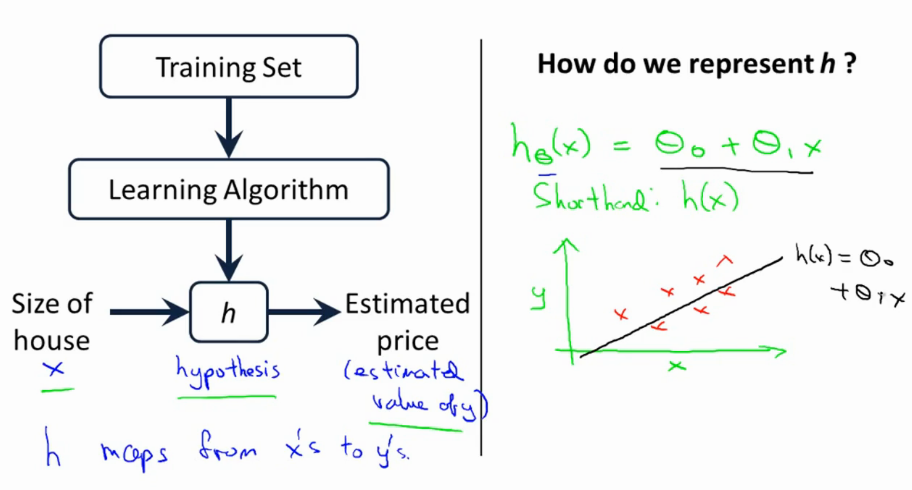
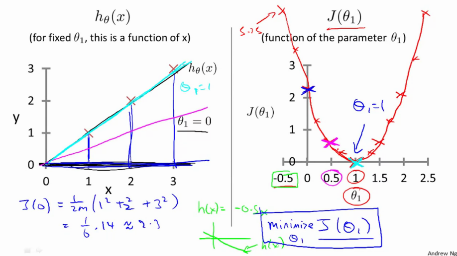
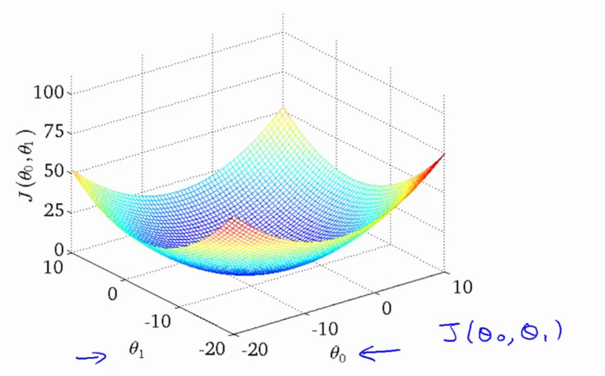

# Andrew NG Machine Learning Coursera Course Notes
Provides notes for Andrew NG Machine Learning Course on Coursera. 

# Lesson 1

* Supervised learning -> give right answer 
* Regression problem -> Predict real-valued output 
* Classification problem -> Discrete valued-output  

Notations
=========

* $m$ = num training examples 
* $x's$ = input variable / features
* $y's$ = output / target variable
* $(x,y)$ = one training sample
* ($x^i$, $y^i$) -> i-th training sample; $i=1...m$

Model
=====

* Starting with the linear case first. More complex models grow from here.
* This model is called a linear regression with one variable: x.
* Also named Univariate Linear Regression

Goal
----

Given a training set, our goal is to find a function $h : X \rightarrow Y$ so that $h(x)$ is a good predictor for the corresponding value of $Y$.

If target value is continuous $\rightarrow$ $\textit{regression}$, if discrete $\rightarrow$ $\textit{classification}$

Cost function
-------------

The hypothesis: 

$$\lrHypot$$ 

is just a linear mapping with $\theta_0$ the bias.

$$\textit{min}_{\theta_0, \theta_1} \frac{1}{2m}\sum_{i=1}^{m}(h_{\theta}(x_i) - y_i)^2$$

"Find the values of $\theta_0, \theta_1$ so that the average (1/2m) of the sum of squared errors between my predictions minus the actual values of the X is minimized" .

This means we need to minimize the Mean-Squared-Error cost function 

$$\lrLoss$$

<!-- lrJ defined in macros -> $$J(\theta_0, \theta_1) = \frac{1}{2m}\sum_{i=1}^{m}(h_{\theta}(x_i) - y_i)^2 $$ -->

Example
-------
J(0.5) --> Each value of $\theta_1$ gives a different loss. We want to find the value that MINIMIZES this value, in this case the GLOBAL MINIMUM  $\theta_1 = 1$. 

Only $\theta_1$ is a sort of bow shape. If you have both $\theta_0$ and $\theta_1$ you have a 3d plot as follows

Gradient Descent
================

More general algo --> use GD to minimize some arbitrary cost function $J(\theta_0, \theta_1)$

* start with some random $\theta_0$ and $\theta_1$
* keep changing both to reduce $J$
* do this until you converge to a (local) minimum
* if you start in a different point, you might get a different local minimum

Gradient Descent Algorithm
--------------------------

<!-- The cost function \costfct is defined in macros.json -->
repeat untill convergence {  
    $\qquad$ $\genericGD$\
} (for $j$ = 0 and $j$=1)

Where:

* := is the assignment operator --> a:=b set a to be value of b
* = is the truth assertion --> a==b
* $\alpha$ is the learning rate
* $\frac{\delta}{\delta\theta_j}$ is the partial derivative of the var in the cost function 
* for $j$=0 and $j$=1 --> *simulataneously* update $\theta_0$ and $\theta_1$

    * this means that the correct way is as follows\
        $\textnormal{temp}_0 := \theta_0 - \alpha(\frac{\delta}{\delta\theta_0})J(\theta_0, \theta_1)$\
        $\textnormal{temp}_1 := \theta_1 - \alpha(\frac{\delta}{\delta\theta_1})J(\theta_0, \theta_1)$\
        $\theta_0 := temp_0$\
        $\theta_1 := temp_1$
    * and **NOT** in this order, as it will change the values.\
        $\textnormal{temp}_0 := \theta_0 - \alpha(\frac{\delta}{\delta\theta_0})J(\theta_0, \theta_1)$\
        $\theta_0 := temp_0$\
        $\textnormal{temp}_1 := \theta_1 - \alpha(\frac{\delta}{\delta\theta_1})J(\theta_0, \theta_1)$\
        $\theta_1 := temp_1$
* The simulatenous update is easier to implement and more natural. 

Answer to the question in the video:

* Q: Suppose $\theta_0$=1,$\theta_1$=2, and we simultaneously update $\theta_0$​ and $\theta_1$​ using the rule: $\theta_j$:=$\theta_j$+$\sqrt{\theta_0 \theta_1}$ (for j = 0 and j=1). What are the resulting values of $\theta_0$ and $\theta_1$​?
* A: \
    $\quad \theta_0 = 1 + \sqrt{1*2}$\
    $\quad \theta_1 = 2 + \sqrt{2*1}$

Gradient Descent Intuition
--------------------------

* Essentially *taking the slope of the line that is tangent to the (cost)function.*
* If $\alpha$ is too small, it takes long, if $\alpha$ is too big, it might fail to converge / overshoot.

Answer to the question in the video:

* Q: Suppose $\theta_1$​ is at a local optimum of $J(\theta_1)$. What will one step of gradient descent $\theta_1:=\theta_1−\alpha\frac{\delta}{\delta\theta_1}J(\theta_1)$ do?
* A: Leave $\theta_1$ unchanged

This also means that GD can converge to a local minimum even with a fixed learning rate $\alpha$. As we approach a local minimum, GD will automatically take smalelr steps. (if $\delta$ is steep, bigger steps, if $\delta$ is small, smaller steps). $\delta$ approaches 0 as we approach the bottom of our *convex* function.

Gradient Descent for Linear Regression
--------------------------------------

We want to do the update step

$$\genericGD$$ 

on the loss function 

$$\lrLoss$$

with hypothesis 

$$\lrHypot$$

