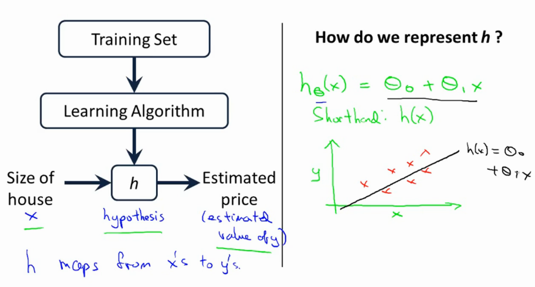
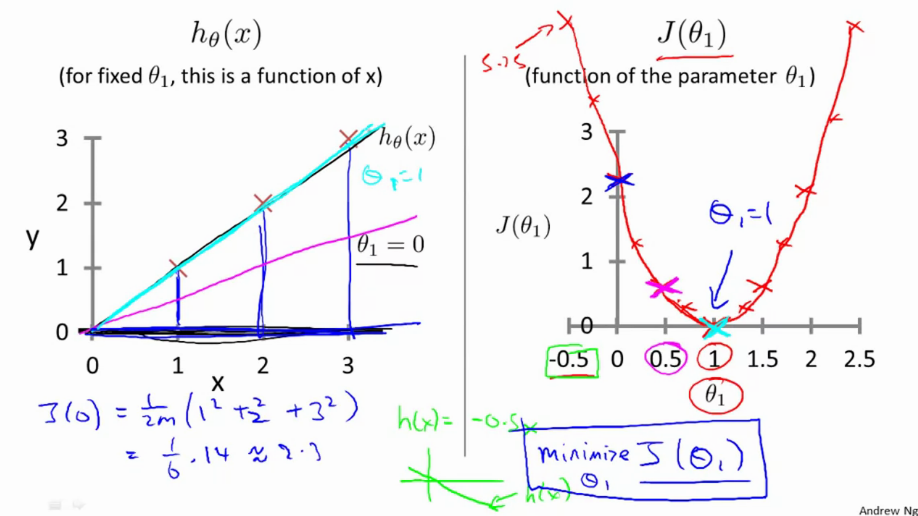
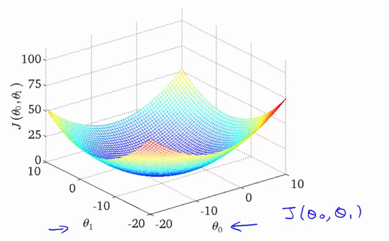

# Andrew NG Machine Learning Coursera Course Notes
Provides notes for Andrew NG Machine Learning Course on Coursera. 

# Week 1

* Supervised learning -> give right answer 
* Regression problem -> Predict real-valued output 
* Classification problem -> Discrete valued-output  

## Notations


* $m$ = num training examples 
* $x's$ = input variable / features
* $y's$ = output / target variable
* $(x,y)$ = one training sample
* ($x^i$, $y^i$) -> i-th training sample; $i=1...m$

## Model


* Starting with the linear case first. More complex models grow from here.
* This model is called a linear regression with one variable: x.
* Also named Univariate Linear Regression



### Goal

Given a training set, our goal is to find a function $h : X \rightarrow Y$ so that $h(x)$ is a good predictor for the corresponding value of $Y$.

If target value is continuous $\rightarrow$ $\textit{regression}$, if discrete $\rightarrow$ $\textit{classification}$

### Cost function

The hypothesis:

$$\lrHypot$$

is just a linear mapping with $\theta_0$ the bias.

$$\textit{min}_{\theta_0, \theta_1} \frac{1}{2m}\sum_{i=1}^{m}(h_{\theta}(x_i) - y_i)^2$$

"Find the values of $\theta_0, \theta_1$ so that the average (1/2m) of the sum of squared errors between my predictions minus the actual values of the X is minimized" .

This means we need to minimize the Mean-Squared-Error cost function 

$$\lrLoss$$

<!-- lrJ defined in macros -> $$J(\theta_0, \theta_1) = \frac{1}{2m}\sum_{i=1}^{m}(h_{\theta}(x_i) - y_i)^2 $$ -->

### Example

J(0.5) --> Each value of $\theta_1$ gives a different loss. We want to find the value that MINIMIZES this value, in this case the GLOBAL MINIMUM  $\theta_1 = 1$. 



Only $\theta_1$ is a sort of bow shape. If you have both $\theta_0$ and $\theta_1$ you have a 3d plot as follows



## Gradient Descent

More general algo --> use GD to minimize some arbitrary cost function $J(\theta_0, \theta_1)$

* start with some random $\theta_0$ and $\theta_1$
* keep changing both to reduce $J$
* do this until you converge to a (local) minimum
* if you start in a different point, you might get a different local minimum

### Gradient Descent Algorithm

<!-- The cost function \costfct is defined in macros.json -->
repeat untill convergence {  
    $\qquad$ $\genericGD$\
} (for $j$ = 0 and $j$=1)

Where:

* := is the assignment operator --> a:=b set a to be value of b
* = is the truth assertion --> a==b
* $\alpha$ is the learning rate
* $\frac{\delta}{\delta\theta_j}$ is the partial derivative of the var in the cost function 
* for $j$=0 and $j$=1 --> *simulataneously* update $\theta_0$ and $\theta_1$

    * this means that the correct way is as follows\
        $\textnormal{temp}_0 := \theta_0 - \alpha(\frac{\delta}{\delta\theta_0})J(\theta_0, \theta_1)$\
        $\textnormal{temp}_1 := \theta_1 - \alpha(\frac{\delta}{\delta\theta_1})J(\theta_0, \theta_1)$\
        $\theta_0 := temp_0$\
        $\theta_1 := temp_1$
    * and **NOT** in this order, as it will change the values.\
        $\textnormal{temp}_0 := \theta_0 - \alpha(\frac{\delta}{\delta\theta_0})J(\theta_0, \theta_1)$\
        $\theta_0 := temp_0$\
        $\textnormal{temp}_1 := \theta_1 - \alpha(\frac{\delta}{\delta\theta_1})J(\theta_0, \theta_1)$\
        $\theta_1 := temp_1$
* The simulatenous update is easier to implement and more natural. 

Answer to the question in the video:

* Q: Suppose $\theta_0$=1,$\theta_1$=2, and we simultaneously update $\theta_0$​ and $\theta_1$​ using the rule: $\theta_j$:=$\theta_j$+$\sqrt{\theta_0 \theta_1}$ (for j = 0 and j=1). What are the resulting values of $\theta_0$ and $\theta_1$​?
* A: \
    $\quad \theta_0 = 1 + \sqrt{1*2}$\
    $\quad \theta_1 = 2 + \sqrt{2*1}$

### Gradient Descent Intuition

* Essentially *taking the slope of the line that is tangent to the (cost)function.*
* If $\alpha$ is too small, it takes long, if $\alpha$ is too big, it might fail to converge / overshoot.

Answer to the question in the video:

* Q: Suppose $\theta_1$​ is at a local optimum of $J(\theta_1)$. What will one step of gradient descent $\theta_1:=\theta_1−\alpha\frac{\delta}{\delta\theta_1}J(\theta_1)$ do?
* A: Leave $\theta_1$ unchanged

This also means that GD can converge to a local minimum even with a fixed learning rate $\alpha$. As we approach a local minimum, GD will automatically take smalelr steps. (if $\delta$ is steep, bigger steps, if $\delta$ is small, smaller steps). $\delta$ approaches 0 as we approach the bottom of our *convex* function.

### Gradient Descent for Linear Regression

We want to do the update step

$$\genericGD$$

on the loss function

$$\lrLoss$$

with hypothesis

$$\lrHypot$$

Figure out the partial derivative first:

$$ \deriv{j} $$

Which simplifies to:

$$ \theta_0: j = 0 : \deriv{0} = \frac{1}{m} \sum_{i=1}^m(h_\theta(x^{(i)})-y^{(i)}) $$

$$ \theta_1: j = 1 : \deriv{1} = \frac{1}{m} \sum_{i=1}^m(h_\theta(x^{(i)})-y^{(i)})  x^{(i)} $$

So then we can repeat the following until convergence:

repeat untill convergence {  
    $\qquad \theta_0 := \theta_0 - \alpha \deriv{0}$\
    $\qquad \theta_1 := \theta_1 - \alpha \deriv{1}$\
} (for $j$ = 0 and $j$=1 and simultaneously)

Which is a **convex quadratic function** for linear regression $\rightarrow$ bow-shaped function that **does not have any other optimum besides the global optimum.**

"Batch" gradient descent: use *all* of the training examples $\ra$ we sum over all *m* training samples.

Answer to the question in the video:

* Q: Which of the following are true statements? Select all that apply.
* A:
    * [ ] To make gradient descent converge, we must slowly decrease $\alpha$ over time.
    * [ ] Gradient descent is guaranteed to find the global minimum for any function $J(\t{0}, \t{1})$.
    * [x] Gradient descent can converge even if $\alpha$ is kept fixed. (But $\alpha$ cannot be too large, or else it may fail to converge.)
    * [x] For the specific choice of cost function $J(\t{0}, \t{1})$ used in linear regression, there are no local optima (other than the global optimum).

## Matrices and Vectors

Matrix example:

$$\begin{bmatrix}1 & 2 & 3 \\4& 5 & 6 \end{bmatrix}$$ 

With as dimension [number of rows x number of columns]. Above is a 2x3 matrix. Also written as $\RR^{2x3}$.

(there is a question in the video, but its really straight forward)

$$A = \begin{bmatrix} 1402 & 191 \\ 1371 & 821 \\ 949 & 1437 \\ 147 & 1448 \end{bmatrix}$$

Where $A_{ij}$ = i, j entry ($i^{th}$ row and $j^{th}$ col).

* $A_{1, 1} = 1402$
* $A_{1, 2} = 191$
* $A_{3, 2} = 1437$

(there is a question in the video, but its really straight forward)

A vector example:

$$ y = \begin{bmatrix} 460 \\ 232 \\ 315 \\ 178 \end{bmatrix}$$ 

Ergo $y$ exists in $\RR^4$. Indexing can start at 0 or 1, but **assume we use 1-indexed vectors**. Use capital letters for matrices, and lowercase for vectors or scalars.

Some sample matlab / octave commands

```matlab
% The ; denotes we are going back to a new row.
A = [1, 2, 3; 4, 5, 6; 7, 8, 9; 10, 11, 12]

% Initialize a vector
v = [1;2;3]

% Get the dimension of the matrix A where m = rows and n = columns
[m,n] = size(A)

% You could also store it this way
dim_A = size(A)

% Get the dimension of the vector v
dim_v = size(v)

% Now let's index into the 2nd row 3rd column of matrix A
A_23 = A(2,3)
```

### Matrix operations

Lets have two matrices $A = \begin{bmatrix} 1&0 \\ 2& 5 \\ 3 &1 \end{bmatrix}$ and $B = \begin{bmatrix} 4&0.5 \\ 2&5 \\ 0&1 \end{bmatrix}$

Elementwise addition then gives us $A + B =  \begin{bmatrix} 5 & 0.5 \\ 4 & 10 \\ 3 & 2 \end{bmatrix}$

Scalar multiplication $3 \cdot A = \begin{bmatrix} 3 & 0 \\ 6 & 15 \\ 9 & 3 \end{bmatrix}$ or $\frac{A}{4} = \begin{bmatrix} 0.25 & 0\\0.5 & 1.25 \\ 0.75 & 0.25 \end{bmatrix}$

Combination of operands: mult/div > sum/diff

Example:

$\begin{bmatrix} 4 \\ 6 \\ 7 \end{bmatrix}/2 - 3\cdot\begin{bmatrix} 2 \\ 1 \\ 0\end{bmatrix} = \begin{bmatrix} 2 - 6\\ 3 - 3 \\ 3.5 - 0\end{bmatrix} = \begin{bmatrix} -4 \\ 0 \\ 3.5 \end{bmatrix}$ 

```matlab
% Initialize matrix A and B
A = [1, 2, 4; 5, 3, 2]
B = [1, 3, 4; 1, 1, 1]

% Initialize constant s
s = 2

% See how element-wise addition works
add_AB = A + B

% See how element-wise subtraction works
sub_AB = A - B

% See how scalar multiplication works
mult_As = A * s

% Divide A by s
div_As = A / s

% What happens if we have a Matrix + scalar?
add_As = A + s
```

### Matrix Vector Multiplication

Assume $A$ = [m x n] and $B$ = [n x 1]. If we want to do $A*B$, the result will be of dimension $C$ = [m x 1]. We take the $i^{th}$ row of $A$ and sum the results of the multiplcation with the first value of $B$.

Example:

$$C = A \cdot B = \begin{bmatrix} 1 & 2 & 1 & 5 \\ 0 & 3 & 0 & 4 \\ -1 & -2 & 0 & 0 \end{bmatrix} \cdot \begin{bmatrix}1 \\ 3 \\ 2 \\1\end{bmatrix}$$

The dimension of the above product will be [3x4][4x1] = [3x1]. 
The result of the product will be

$$ \begin{bmatrix} 1*1 + 2*3 + 1*2 + 5*1 \\ 0*1 + 3*3 + 0*2 + 4*1 \\ -1*1 + -2*3 + 0*2 + 0*1 &  \end{bmatrix} = \begin{bmatrix}14 \\ 13 \\ -7\end{bmatrix}$$

Example of house sizes:
Using the hypothesis

$$ h_\theta(x) = -40 + 0.25x$$

And the house prices in the second column:

$$ M = \begin{bmatrix} 1 & 2104 \\ 1 & 1416 \\ 1 & 1534 \\ 1 & 852 \end{bmatrix}, h_\theta(x) = \begin{bmatrix} -40 \\ 0.25 \end{bmatrix}$$

Then the prediction becomes:

$$ \textnormal{Prediction} = M \cdot h_\theta = \begin{bmatrix} -40*1 + 0.25*2104 \\ -40*1 + 0.25*1416 \\ -40*1 + 0.25*1534 \\ -40*1 + 0.25*852 \end{bmatrix} $$

### Matrix Matrix Multiplication

Assume $A$ is a matrix with dim [mxn], and $B$ is a matrix with dim [nxo], then the multiplication of $A$ and $B$ is a matrix $C$ with dim[mxo].

**The $i^{th}$ column of matrix $C$ is obtained by multiplying A with the $i^{th}$ column of matrix $B$ (for $i = 1, 2, ..., o$).**

$$ \begin{bmatrix} 1 & 3 \\ 2 & 5 \end{bmatrix} \begin{bmatrix} 0 & 1 \\ 3 & 2 \end{bmatrix} = \begin{bmatrix} 1*0 + 3*3 & 1*1 + 3*2 \\ 2* 0 + 5*3 & 2*1 + 5*2\end{bmatrix}  = \begin{bmatrix}9 & 4 \\ 15 & 12 \end{bmatrix}$$

To solve the house sizes problem:

We have 3 competing hypothesis:

* $h_{\t{0}}(x) = -40 + 0.25x$
* $h_{\t{1}}(x) = 200 + 0.1x$
* $h_{\t{2}}(x) = -150 + 0.4x$

With the housing prizes this becomes:

$$\begin{bmatrix} 1 & 2104 \\ 1 & 1416 \\ 1 & 1534 \\ 1 & 852\end{bmatrix} \cdot \begin{bmatrix} -40 & 200 & -150 \\ 0.25 & 0.1 & 0.4 \end{bmatrix} = \begin{bmatrix} h_{\t{0}} & h_{\t{1}} & h_{\t{2}} \\ 486 & 410 & 692 \\ 314 & 342 & 416 \\ 344 & 353 & 464 \\ 173 & 285 & 191 \end{bmatrix}$$

Which yields all twelve predictions in one easy matmul.

### Matmul Multiplication Properties

Let $A$ and $B$ be matrices

* **NOT COMMUTATIVE**: In general $A * B \ne B * A$.
* **ARE ASSOCIATIVE**: $A \cdot B \cdot C = A \cdot (B \cdot C) = (A \cdot B) \cdot C$
* Identity Matrix is given by $I_{n \cdot n}$, and $A \cdot I = I \cdot A = A$. For example

$$ I_{3} = \begin{bmatrix}1 & 0 & 0 \\ 0 & 1 & 0 \\ 0 & 0 & 1\end{bmatrix}$$

### Inverse and Transpose

Given some number, i.e. 3, there exists a number that if you multiply it with this number it gives you the identity.

Formally, this means that there exists a number , element of $\RR^2$ without 0.

$$ A(A^{-1}) = A^{-1}A= I.$$

#### Matrix inverse

* Only **square matrices** have inverses.
* For example $\mat{3 & 4 \\ 2 & 16} \cdot \mat{0.4 & -0.1 \\ -0.05 & 0.075} = \mat{1 & 0 \\ 0 & 1} = I_{2x2}$
* Not necessarily all matrices have an inverse. Matrices that don't have an inverse are *singular* or *degenerate*. 

```matlab
A = [3 4; 2 16];
% inverse of a
A_inv = pinv(A);  

A*A_inv == I;
> True
```

#### Matrix Transpose

Columns become rows and rows become columns.

Let $A$ be an mxn matrix and let $B=A^T$. Then $B$ is an nxm matrix and $B_{ij} = A_{ji}$.
