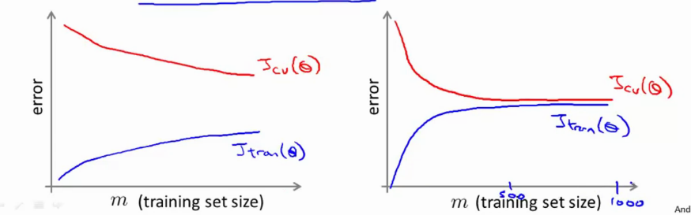

# Week 10 notes

More general notes available on the [coursera website](https://www.coursera.org/learn/machine-learning/resources/srQ23)

## Learning with large datasets

* large means $m > 100 000 000$
* to perform 1 step of gradient descent, we need to sum 100 million elements........
* try $m=1000$ to sanity check if it would actually work, and plot a learning curve for a range of values of m and verify that the algo has high variance when m is small.

 

* if the case is the left, (large variacne) we can increase the training set size. In the case on the right, there's no reason to actually get a million samples.

### Stochastic Gradient Descent

* normally, we take a cost function adn minimize it using gd. 
* if dataset is large, gd becomes computationally too expensive

Original model: BATCH gradient descent (using ALL of the examples in one go). Read everything in your memory, accumulate the sum, take 1 step.... need to do the whole thing again, etc etc. Will take a very long time.

Stochastic Gradient descent: evaluates how well the current cost function is doing on a single example $x_i, y_i$. 

1) Randomly shuffle dataset.
2) Repeat for i=1:m { update $\t{j}}$ }
    * modify paramteers just a bit and take a very small step

`Its quite similar to batch gradient descent, but we take only one sample to take a step instead of summation of all.`

* batch gd will take a fairly straight line to the center
* in contrast, SGD will make more crooked lines, but generally towards the global minimum. It "wanders around" in a region close to the global minimum.

* The outer loop is called the `epochs`, or a pass in the dataset.

### Mini-batch gradient descent

* batch gd --> use all $m$ examples in each iteration
* sgd --> use single example in each iteration
* mini-batch gd--> use $b$ examples in each iteration ($b = 2-100$).

### SGD convergence

* how to check if it works properly (converging)
* how to pick learning rate $\alpha$

In batch GD, we would plot the cost function and see that it decreases every iteration.

* while looking at $\ssbi{x}, \ssbi{y}$, right before updating $\t{}$, compute the cost, averaged over the last 1000 examples or so.
* this makes that it should go down, but it can be noisy

* top left: learning rate changes in red (red < blue). Smaller learning rate means less wandering around the global minimum on convergence.
* top right: increasing the number of samples before you average can make the curve smoother.
* bottom left: blue line too noisy so you can't see the trend properly, maybe increase the samples you average over.
* bottom right: curve goes up: this is sign that the algorithm is diverging, use smaller $\alpha$

To lessen the effect of "wandering around global minimum", we lower the value of $\alpha$ over the number of steps we've taken. Ie variable learning rate, from 0.1 to 0.0001...

### Online learning

* model problems where we have continuous data stream

Example:

* shipping service where users specifiy origin and destination
* you offer to ship for some price, sometimes users choose you ($y=1$) or not ($y=0$).
* features $x$ capture properties of user, of origin/dest and price. We want to learn $p(y=1 | x; \t{})$ to optimize price.

We could use logistic regression for this.

1) When a new user comes, we make a new pair (origin/dest) , and y=0,1 if they chose us or not.
2) Now, we can update our params $\t{}$ using this new sample. `throw this sample away after update step, so you dont need to keep it..`

This online type learning algorithm is kind of free if you have a large number of users. This can also adapt to changing user preferences, such as change in population due to economy drop / ...

This works particularly well for stuff like product search, ie. learning to search. Imagine we have 100 phones, but the website can only display 10. $x$ are the features, such as search terms etc... then mark $y=1$ if user clicks, otherwise $y=0$. Learn probability that user clicks phone $p(y=1 | x; \t{})$. `This is called learning the predicted Click-Through-Rate (CTR)`. Now, we can predict the top 10 phones a user is most likely click on.

Other examples

* special offers
* customized news articles
* product recommendations..

### Map reduce and data parallelism

* so much data you dont want to run it on 1 pc, maybe on 10 devices or whatever

Imagine you have 400 000 000 000 examples, and you want to train BATCH GD on 4machines at the same time.

* machine1: use first 25%
* machine2: use second 25%...
* ...

Calculate the update for each machine, called "temp_updates", send to "master" server

* now we can update $\t{} := \t{} - \alpha/m * (\sum(\textnormal{temp\_updates}))$

In pracitce you get a little smaller speedup due to latencies etc..

Questions to ask yourself:

* can the learning algo be expressed as sums of functions over training set (so you can actually split it)
    * for logistic regression: we need to compute J_train, which is a sum so we can split it. You also need to compute the partial derivatives, which is also a sum so you can split it.

* you can also use multi-core machines so speed up the training process. Send each part of the training set to a different core (parallelize over cores). Most libraries already have parallelization implemented.

