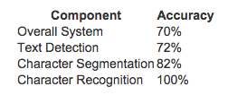

# Quiz week 1 : Photo OCR

## Q1

Suppose you are running a sliding window detector to find text in images. Your input images are 1000x1000 pixels. You will run your sliding windows detector at two scales, 10x10 and 20x20 (i.e., you will run your classifier on lots of 10x10 patches to decide if they contain text or not; and also on lots of 20x20 patches), and you will "step" your detector by 2 pixels each time. About how many times will you end up running your classifier on a single 1000x1000 test set image?

* [ ] 100,000
* [ ] 250,000
* [ ] 1,000,000
* [x] 500,000

`10x10 scale, 2 pixel stride: 500 per row, 500 per col -> 250 000` 

`20x20 scale, 2 pixel stride: 500 per row, 500 per col -> 250 000`

## q2

Suppose that you just joined a product team that has been developing a machine learning application, using $m=1000$ training examples. You discover that you have the option of hiring additional personnel to help collect and label data. You estimate that you would have to pay each of the labellers dollar 10 per hour, and that each labeller can label 4 examples per minute. About how much will it cost to hire labellers to label 10,000 new training examples:

`4 per minute is 4*60=240 per huor, need 10000/240 = 41.6 hours and so 41.6*10 = 416 dollar` 

## q3

What are the benefits of performing a ceiling analysis? Check all that apply.

* [ ] A ceiling analysis helps us to decide what is the most promising learning algorithm (e.g., logistic regression vs. a neural network vs. an SVM) to apply to a specific component of a machine learning pipeline.

* [x] It gives us information about which components, if improved, are most likely to have a significant impact on the performance of the final system.

* [ ] If we have a low-performing component, the ceiling analysis can tell us if that component has a high bias problem or a high variance problem.

* [x] It can help indicate that certain components of a system might not be worth a significant amount of work improving, because even if it had perfect performance its impact on the overall system may be small.

## q4

Suppose you are building an object classifier, that takes as input an image, and recognizes that image as either containing a car ($y=1$) or not ($y=0$). For example, here are a positive example and a negative example:

After carefully analyzing the performance of your algorithm, you conclude that you need more positive ($y=1$) training examples. Which of the following might be a good way to get additional positive examples?

* [x] Apply translations, distortions, and rotations to the images already in your training set.

* [ ] Select two car images and average them to make a third example.

* [ ] Take a few images from your training set, and add random, gaussian noise to every pixel.

* [ ] Make two copies of each image in the training set; this immediately doubles your training set size.

## q5

Suppose you have a PhotoOCR system, where you have the following pipeline:

You have decided to perform a ceiling analysis on this system, and find the following:

Which of the following statements are true?

* [ ] There is a large gain in performance possible in improving the character recognition system.

* [x] Performing the ceiling analysis shown here requires that we have ground-truth labels for the text detection, character segmentation and the character recognition systems.

* [] The least promising component to work on is the character recognition system, since it is already obtaining 100% accuracy .  `this was probably the right answer.`

* [ ] The most promising component to work on is the text detection system, since it has the lowest performance (72%) and thus the biggest potential gain. `no!`

`second try below`

* [x] The potential benefit to having a significantly improved text detection system is small, and thus it may not be worth significant effort trying to improve it.

* [x] If we conclude that the character recognition's errors are mostly due to the character recognition system having high variance, then it may be worth significant effort obtaining additional training data for character recognition.

* [ ] We should dedicate significant effort to collecting additional training data for the text detection system. 