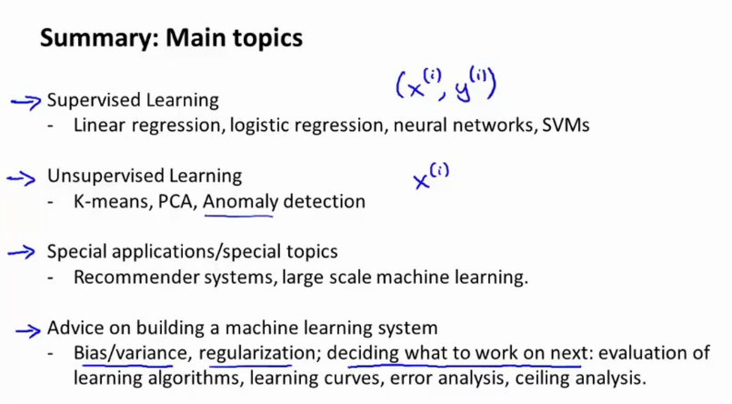

# Week 11 - OCR

A big machine learning pipeline can look as follows.

## Problem description and pipeline

Photo OCR -> photo optical character recognition.

* how to get computers to read text in images

Steps

1) find locations of text (detection)
2) read the text (character segmentation)
3) character classification
4) spelling correction or something similar

### Photo OCR pipeline

You can split a team of engineers to do one part of the pipeline.

### Sliding windows

* The aspect ratios of objects can differ
* might make detection difficult

Example of pedestrian detection

* $x$ = pixels in $82\times36$ image patches.
* have positive examples ($y=1$) and negative samples $y=0$.
* in a new image, we slide the image patch and classify if theres a pedestrian in this image.
* the amount you "slide" the window is called the `stride`
* can take larger patch, resize to smaller patch, run classifier to get different scales (further away,...)

Example of text detection

* similarly, we can find positive and negative examples
* train a classifier to yes/no text/notext
* now take a new image, use sliding window approach
* after we get a probability map, use morphological operations to expand the selection, so that we get a bar-shape instead of seperate blobs
* finally, extract the connected components and draw bounding boxes. Rule out rectangles that to not have a good aspect ratio.

Now we have a new image that has a combination of letters. We can once again do a sliding window approach to extract single characters, but now in 1D (only horizontal, single row). One can also make a classifier to predict whether we are inbetween two characters or not.

### Getting lots of data and artificial data

Artificial data synthesis for photo OCR

* take real data
* characters from fonts pasted onto a random background -> synthetic data, blur it bit, some other ops rotation ,...
* doing a sloppy job in creating this data is bad, shit in is shit out
* create additional data by applying ops
    * distortions
    * skew
    * rotate
    * translate
    * ...

`however, make sure the distortions are representative of the noise / distortions in the test set. Usually it does not help to add purely random noise to your data. stay in distribution!`

Things to consider

1) Make sure you have a low bias clssifier (plot learning curves), increase number of features untill you have low bias. `before making huge training set`
2) how much work would it be to get 10x as much data? For example by
    * artificial data synthesis, or by introducing distortions;
    * collect (and label) extra data (calculate the amount of time to get/label one sample and fnid how much time it costs); 
    * finally, use mechanical turk or some other service to crowdsource data

### Ceiling analysis: what part of the pipeline to work on next

* time is the most important resource
* figure out which part of the pipeline requires the most attention!

Keep the example of photo ocr in mind

* imagine a single real-number evaluation such as total system accuracy
* now, take each of the pipeline components and calculate where the largest accuracy loss occurs. This is the component where you need to put work into.
* If that component is a classifier training using gradient descent, it is probably not worth running gradient descent for 10x as long to see if it converges to better classifier parameters.
* in other words,
    * if your complete system accuracy is 72%, 
    * your ground thruth means 100% acc, 
    * then after step 1 (text detection), your accuracy is 89%, 
    * after step 2 (character segmetnation), your acc is 90%,
    * after step 3 (character recognition) , your acc is 100% 
* this means that the largest deficit is in text detection, so you shuold focus on this, followed by character recognition.
* Introduce "perfect" scores for each of the components (ground thruth for each part of the pipeline).

Now you can also figure out how much you can gain by doing some work.

`Do the analysis up front so you dont spend 2 years working on useless shit :) :) :):) :) :):) :) :)`

# DONT TRUST YOUR GUT FEELING TO FIGURE WHAT TO DO NEXT, USE NUMBERS!

# Summary! 

