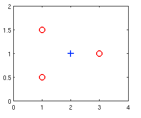
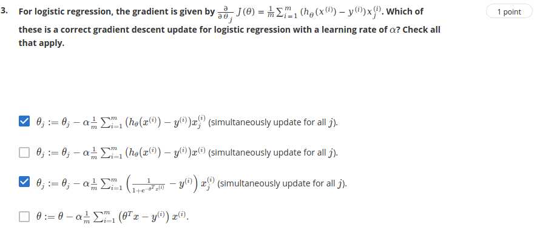

# Quiz : Logistic regression

## Q1:  Suppose that you have trained a logistic regression classifier, and it outputs on a new example $x$ a prediction $\htx=0.4$. This means (check all that apply):

* [x] Our estimate for $P(y=1|x;θ)$ is 0.4.
* [ ] Our estimate for $P(y=0|x;θ)$ is 0.4.
* [ ] Our estimate for $P(y=1|x;θ)$ is 0.6.
* [x] Our estimate for $P(y=0|x;θ)$ is 0.6.

## Q2: Suppose you have the following training set, and fit a logistic regression classifier $\htx = g(\t{0}+ \t{1}x_1 + \t{2}x_2)$

`incorrect` 

$$\mat{ x_1 && x2   && y \\ \hline
        1   && 0.5  && 0 \\
        1   && 1.5  && 0 \\
        2   && 1    && 1 \\
        3   && 1    && 0}$$

Which of the following are true? Check all that apply.

* [ ] $J(\t{})$ will be a convex function, so gradient descent should converge to the global minimum.

* [x] Adding polynomial features (e.g., instead using $\htx = g(\t{0} + \t{1}x_1 + \t{2}x_2 + \t{3}x_1^2 + \t{4}x_1x_2 + \t{5}x_2^2$)) could increase how well we can fit the training data. `the key is in the COULD word`

* [ ]The positive and negative examples cannot be separated using a straight line. So, gradient descent will fail to converge.

* [ ] Because the positive and negative examples cannot be separated using a straight line, linear regression will perform as well as logistic regression on this data. `logistic wil outperform linear since cost function focusses on classification, not prediction`

* [x]  At the optimal value of θ\thetaθ (e.g., found by fminunc), we will have $J(\t{}) \geq 0$. `always positive cost funct`

* [ ]  If we train gradient descent for enough iterations, for some examples $x^{(i)}$ in the training set it is possible to obtain $\htx^{(i)} > 1$. `in training impo`

## Q3: for logistic regression, the gradient is given by ...... Which of these is a correct gradient descent update for logistic regression with a learning rate of $\alpha$? Check all that apply.

`nr 2 doesnt have $x_j$ as final term. Nr 4 is not the correct vectorized implementation, as this would be (from notes)`

$$ \logGDVec $$

## Q4:  Which of the following statements are true? Check all that apply.

* [x] The cost function $J(\t{})$ for logistic regression trained with $m\geq1$ examples is always greater than or equal to zero. `cost is always gt 0 since it is the negative log of a quantitiy less than one.` 

* [ ] For logistic regression, sometimes gradient descent will converge to a local minimum (and fail to find the global minimum). This is the reason we prefer more advanced optimization algorithms such as fminunc (conjugate gradient/BFGS/L-BFGS/etc). `GD always converges because cost function is convex. we use the others bc theyre faster and dont have to select learning rate`

* [ ] Linear regression always works well for classification if you classify by using a threshold on the prediction made by linear regression. `linear often calssifies poorly since its training focusses on predicting real valued outputs`

* [x] The sigmoid function $\sigmoid$ is never greater than one.

## Q5: Suppose you train a logistic classifier with

$$ \htx = g(\underbrace{\t{0}}_{=6} + \underbrace{\t{1}}_{=-1}x_1 + \underbrace{\t{2}}_{=0}x_2)$$

Suppose Which of the following figures represents the decision boundary found by your classifier?

This means we want to find the place where

$$ 6 - x_1 \geq 0$$
$$ -x_1 \geq -6$$
$$ x_1 \leq 6$$

and $x_2$ doesn't matter.

Second example

* t0 = 6, t1 =0 , t2=-1

$$ 6 - x_2 \geq 0$$
$$ -x_2 \geq -6$$ 
$$ x_2 \leq 6$$