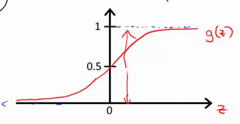
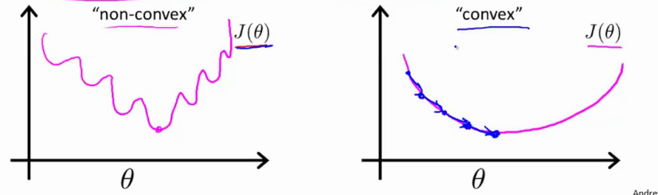

# Week 2

More general notes can be found [on the coursera website](https://www.coursera.org/learn/machine-learning/resources/Zi29t)

## Classification

Examples: email = spam/not spam; tumor = malign / benign; ...

$$y \in \{0,1\}$$

With 0 being the negative class, and 1 being the positive class.

### Binary classification

A simple hypothesis is

$$\binClassHypot$$

Which then can be thresholded at for example 0.5:

* If $h_{\t{}}(x) \geq 0.5 \ra y=1$
* If $h_{\t{}}(x) \leq 0.5 \ra y=0$

This can be influenced by outliers and is detrimental for the performance of the classifier.

`Applying Linear Regression to a classification problem is usually not a good idea.`

Also, the hypothesis can be alot bigger / smaller than 0 or 1.

Introducing Logistic Regression, where:

$$ 0 \leq h_{\t{}}(x) \leq 1 $$

### Hypthesis Representation

#### Logistic Regression Model

We want

$$ 0 \leq h_{\t{}}(x) \leq 1 $$

Define the hypothesis as:

$$ \htx = g(\Theta^Tx)$$

with the sigmoid / logistic function $g(z)$

$$ g(z) = \frac{1}{1 + e^{-z}} $$

That way the hypothesis becomes

$$ \logrHypot$$

Which looks like



And indicates what the `estimated probability` that $y=1$ on input x ($\htx = p(y=1|x; \t{})$, ie the probability that y=1, given x, parametrized by $\t{}$)

`This means that the total probability must be equal to 1`

### Decision boundary

Given this function, we can threshold the probability by for example predicting

* $y=1$ if $\htx \geq 0.5$ then $g(z) \geq 0.5$ when $z \gt 0$, so whenever $\Theta^Tx \geq 0$
* $y=0$ if $\htx \leq 0.5$ when $z \lt 0$, so whenever $\Theta^Tx \leq 0$.

This means that

$$ g(z) \geq 0.5 = g(\Theta^Tx) \geq 0.5$$

is true if $z\geq0$

$$\Theta^Tx \geq 0 \ra y=1$$
$$\Theta^Tx \lt 0 \ra y=0$$

Given an hyptothesis

$$ \htx = g(\underbrace{\t{0}}_{=-3} + \underbrace{\t{1}}_{=1}x_1 + \underbrace{\t{2}}_{=1}x_2)$$

Then we can predict $y=1$ if $\underbrace{-3 + x_1 + x_2}_{\Theta^Tx} \geq 0$, and $y=0$ if its $\lt 0$. This can be rewritten as $x_1 + x_2 \geq 3$ and $x_1 + x_2 \lt 3$.

The function that divides the data into the two classes $y=1$ and $y=0$, is called the `decision boundary`. The decision boundary is a property of the hypothesis and of the parameters; this is not a property of the dataset. Later we use the dataset to fit a good set of parameters.

Example in the video

$$ 5 - x_1 \geq 0$$

$$ -x_1 \geq -5$$

$$ x_1 \leq 5$$

for $y=1$, or $y=0$ for $x_1 \geq 5$.

The linear case can be extended to non-linear decision boundaries, by taking for example the hypthesis: 

$$ \htx = g(\t{0} + \t{1}x_1 + \t{2}x_2 + \t{3}x_1^2 + \t{4}x_2^2)$$

With

$$\t{} = \mat{-1 \\ 0 \\ 0 \\ 1 \\ 1}$$

In other words predict $y=1$ if $-1 + x_1^2 + x_2^2 \geq 0$, so if $x_1^2 + x_2^2 \geq 1$. This is a circle with radius 1, where inside the circle everything is 0 and outside everything is 1.

`With higher order polynomials we can achieve more complex decision boundaries.`

### Cost function

Given a training set

$$ \{(x^{(1)}, y^{(1)}), (x^{(2)}, y^{(2)}), ..., (x^{(m)}, y^{(m)})\}$$

With $m$ examples, $x_0 = 1$ and $y\in\{0,1\}$

$$x \in \underbrace{\mat{x_0 \\ x_1 \\ x_2 .. \\ x_n}}_{\RR^{n+1}}$$

and the generic hypothesis

$$\logrHypot$$

How do we choose parameters $\t{}$?

Going back to Linear regression

$$\mvlrCost$$

Where $\frac{1}{2}(h_{\theta}(x^{(i)}) - y^{(i)})^2$ can be named `cost`

Then 

$$ Cost(\htx, y) = \frac{1}{2}(\htx - y)^2$$

For `logistic regression` this would be a non-convex function for the parameters $\t{}$, due to the fact that the sigmoid function is non-linear. 

`A function with many local optima is a non-convex function. In contrast, a convex function has a single 'bow-shape' and thus a single global minimum.`



#### Logistic Regression cost function

$$\textnormal{Cost}(\htx, y) = \Big\{\begin{array}{rl}-\log(\htx) && \textnormal{if} && y=1 \\ -\log(1 - \htx) && \textnormal{if} && y=0 \end{array}$$

<!-- $$\logrCostGeneric$$ -->


This means we penalize wrong predictions with a very large cost.

$$ \logrCost = 0 \if \htx = y$$
$$ \logrCost \ra \inf \if y=0 \and \htx = 1$$
$$ \logrCost \ra \inf \if y=1 \and \htx = 0$$

`Writing the cost function this way asserts that` $J(\t{})$ `is convex for logistic regression`

### Multiclass Classification - One vs All

Examples:

* Email tagging: work / friends / adverts / family (four classes y=[1,2,3,4])
* Weather: sunny / cloudy / rain / snow

#### One vs all - one vs rest

Example 3 classes $\ra$ become three seperate binary classifiers. Train a logistic regression classifier for each class $i$ to predict the probability that $y=i$. 

* $\htx^{(1)}(x) \ra P(y=1 | x; \t{})$
* $\htx^{(2)}(x) \ra P(y=2 | x; \t{})$
* $\htx^{(3)}(x) \ra P(y=3 | x; \t{})$

On a new input $x$, pick the class that maximizes $max_i \htx^{(i)}$

## Simplified cost fct

The same cost function rewritten:

$$\logrCostFull$$

* If y=1: cost = $-\log\htx$
* If y=0: cost = $-\log(1-\htx)$

The cost function becomes

$$J(\t{}) = \frac{1}{m}\sum_{i=1}^{m}\textnormal{Cost}(h_{\t{}}(x^{(i)}), y^{(i)})$$

$$J(\t{}) = \frac{-1}{m}[\sum_{i=1}^{m} y^{(i)}\log\htx^{(i)} + (1-y^{(i)})\log(1-h_{\t{}}(x^{(i)}))]$$

To fit the parameters, we try to minimize $J(\t{})$. To make a new prediction given new $x$:

$$ \logrHypot $$

## Gradient Descent

Take the partial derivative of $J$, which becomes

$$\underbrace{\t{j} := \t{j} - \alpha\sum_{i=1}^{m}(h_{\t{}}(x^{(i)})-y^{(i)})x_j^{(i)}}_{\textnormal{simultaneous for all }\t{j}}$$

Which is nearly identical to linear regression. `However, the definition for the hypothesis has changed.`

**For linear regression, the hypothesis is**

$$\htx = \Theta^Tx$$

**And for logistic regression, the hypothesis is**

$$\logrHypot$$

`To monitor GD, plot the loss function and make sure it decreases each iteration.`

A vectorized implementation is

$$\t{}:=\t{} - \alpha\frac{1}{m}\sum_{i=1}^{m}[(h_{\t{}}(x^{(i)}) - y{(i)}) . x^{(i)}] $$

Or shorter

$$ \logGDVec $$

Feature scaling also applies to logistic regression.

## Advanced optimization

You actually only need code to calculate the derivative terms of $J(\t{})$.

We can also use other algorithms such as

* Conjugate Gradient
* BFGS
* L-BFGS

To minimize the cost function. These algorithms have some advantages

* No need to manually pick $\alpha$
* Often faster than GD

And disadvantages:

* more complex

`Don't implement them yourself unless you are an expert in numerical computing. Use software libraries.`

### To optimize, we want to make a function for example in octave: 

$$\t{} = \mat{\t{1} \\ \t{2}}$$

$$J(\t{}) = (\t{1} - 5)^2 + (\t{2} - 5)^2$$

$$\frac{\delta}{\delta{\t{1}}}J(\t{}) = 2(\t{1} - 5)$$

$$\frac{\delta}{\delta{\t{2}}}J(\t{}) = 2(\t{2} - 5)$$

```matlab
function [jVal, gradient] = costFunction(theta)

    jVal = (theta(1)-5)^2 + (theta(2)-5)^2;
    gradient = zeros(2,1);
    gradient(1) = 2*(theta(1) - 5); % octave indexes at 1
    gradient(2) = 2*(theta(2) - 5);


options = optimset('GradObj', 'on', 'MaxIter', 100); % gradobj on = you will provide a gradient, maxiters = 100
initialTheta = zeros(2,1); % and we set a initial theta

[optTheta, functionVal, exitFlag] = fminunc(@costFunction, initialTheta, options); % function minimization unconstrained @ is pointer to the fct.

```

## Regularization

Overfitting vs underfitting

Overfitting: too complex of a function for the given data $\ra$ high variance

Underfitting: too simple of a function for the given data $\ra$ the data shows structure not captured by the model

### Adressing overfitting

* Reduce the number of features
    * manually select features to keep
    * use a model selection algorithm
* Regularization
    * keep all the features but reduce the magnitude of $\t{j}$.
    * works well when we have alot of slightly useful features.

### Cost function

`Best way to understand is to implement it (see programming exercises).`

Take the original cost function and add a penaliztion for $\t{3}, \t{4}$, or any..

$$\mvlrCost + 1000\t{3}^2 + 1000\t{4}^2$$

Taking small values for parameters $\t{0}, \t{1}, ..., \t{n}$ makes that we get a simpler hypthesis and this is less prone to overfitting.

The example of huose pricing

* Features: $x_1, x_2, .... , x_{100}$ 
* Parameters: $\t{0}, \t{1}, \t{2}, ...., \t{100}$

Take the cost function and modify it to add a term at the end: a `regularization term, created by a regularization parameter and -objective`.

$$ J(\t{}) = \frac{1}{2m}\Big[\sum_{i=1}^{m}(h_{\theta}(x^{(i)}) - y^{(i)})^2 + \underbrace{\overbrace{\lambda}^{\textnormal{parameter}}\overbrace{\sum_{i=1}^{n}\t{j}^2}^{\textnormal{objective}}}_{\textnormal{term}}\Big]$$

This makes sure that you can keep a complex curve, but not high variance. If $\lambda$ is too big, we penalize too much (all parameters become close to zero) ergo underfitting will occur (hypothesis = 0) and it will fail to even fit the training set.

`NOTE: we dont penalize theta0!!`

## Regularized Linear Regression

Previously: GD & normal eq.

### Gradient Descent

We had the following regularized cost function:

$$ J(\t{}) = \frac{1}{2m}\Big[\sum_{i=1}^{m}(h_{\theta}(x^{(i)}) - y^{(i)})^2 + \lambda\sum_{i=1}^{n}\t{j}^2\Big]$$

If we want to find the GD updates we can modify the partial derivative as follows (only for $j\geq1$): 

$$\t{j} := \t{j} - \alpha\Big[\frac{1}{m}\sum_{i=1}^{m}(h_{\t{}}(x^{(i)}) - y^{(i)})x^{(i)}_j + \frac{\lambda}{m}\t{j}\Big]$$

We can group all together and get the following update rule: 

$$\t{j} := \t{j}\underbrace{(1-\alpha\frac{\lambda}{m})}_{\lt 1} - \alpha\frac{1}{m}\sum_{i=1}^{m}(h_{\t{}}(x^{(i)}) - y^{(i)})x^{(i)}_j$$

This new term is smaller than one, something like 0.999. Every update we are shrinking the parameter a bit :).

### Normal Eq

$$ X = \mat{(x^{(1)})^T \\ ... \\ (x^{(m)})^T}$$

$$ y = \mat{y^{(i)} \\ ... \\ y^{(m)}}$$

$$\undersetnorm{min}{\t{}} J(\t{}) $$

Taking the partial derivative for each of the params, setting it to zero, we can find the following:

$$ \t{} = \Big(X^TX + \lambda\mat{0 & 0 & ... & 0 \\ 0 & 1 & ... & 0 \\ 0 & 0 & ... & 0 \\ 0 & 0 & ... & 1}\Big)^{-1}X^Ty$$

Or 

$$ \t{} = \Big(X^TX + \lambda L \Big)^{-1}X^Ty$$

With L being an `eye` matrix of dimension (n+1 x n+1) with element $[0,0]$ being 0.

#### Non invertibility

Consider a case where $m \lt n$, so less examples than features. this means the solution to $\t{}$ is singular/non invertible (*may* be non-invertible if $m=n$). Octave's `pinv` function will give you a result that makes a bit of sense, but careful if you use different language. 

However, regularization takes care of this if $\lambda \gt 0$.

## Regularized Logistic Regression

Add a regularization term to the cost function

$$\logrCostLong $$

Such that

$$\logrCostLong + \frac{\lambda}{2m}\sum_{j=1}^{m}\t{j}^2$$

Similar to linear regression, we can combine all to get

$$\t{j} := \t{j} - \alpha\Big[\frac{1}{m}\sum_{i=1}^{m}(h_{\t{}}(x^{(i)}) - y^{(i)})x^{(i)}_j + \frac{\lambda}{m}\t{j}\Big]$$

However, the hypothesis obviously changes to

$$\logrHypot$$

## Advanced optimization logistic regression

Same as above matlab

```matlab
function [jVal, gradient] = costFunction(theta)

    jVal = [code to compute Jtheta];
    gradient = zeros(n,1);
    gradient(1) = [code to compute partial deriv to Jt1]; % octave indexes at 1
    gradient(2) = [code to compute partial deriv to Jt2];


options = optimset('GradObj', 'on', 'MaxIter', 100); % gradobj on = you will provide a gradient, maxiters = 100
initialTheta = zeros(2,1); % and we set a initial theta

[optTheta, functionVal, exitFlag] = fminunc(@costFunction, initialTheta, options); % function minimization unconstrained @ is pointer to the fct.

```

