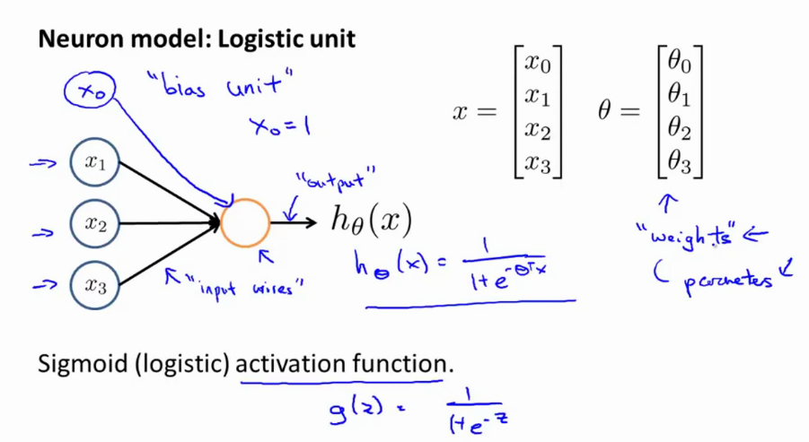
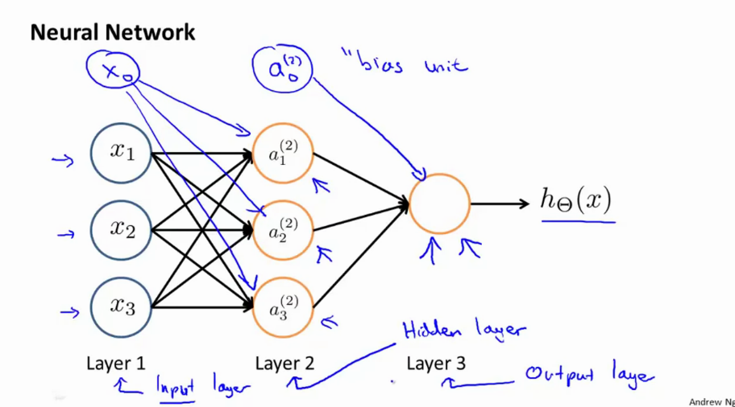
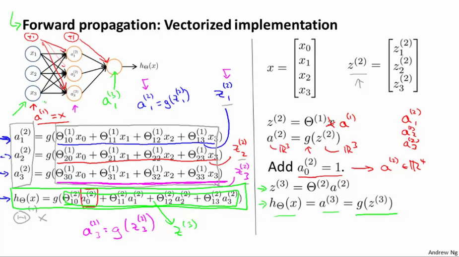
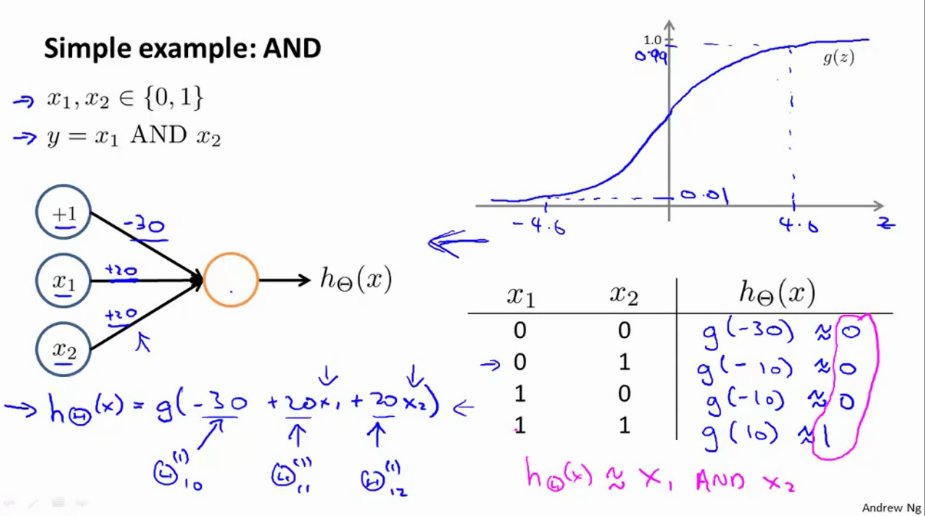
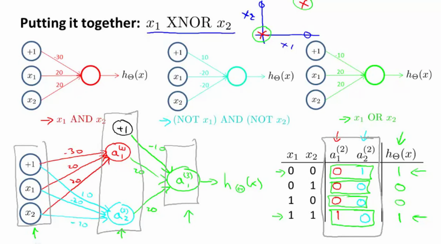

# Week 4 Notes
More general notes can be found [on the coursera website](https://www.coursera.org/learn/machine-learning/resources/RmTEz)

## Model Representation

### Neuron model: Logistic unit
$$ x = \mat{x_0 \\ x_1 \\ x_2 \\ x_3} \ra \mat{\quad}  \ra \htx$$
$$ x = \mat{x_0 \\ x_1 \\ x_2 \\ x_3} \t{} = \mat{\t{0} \\ \t{1} \\ \t{2} \\ \t{3}}$$

### Neural network: multiple neurons

$x_0, a_0, ...$ are the bias units

* 3 inputs, 3 hidden units
* $a_j^{(j)}$ = activation of unit $i$ in layer $j$
* $\Theta^{(j)}$ = matrix of wieghts controlling function mapping from layer $j$ to layer $j+1$. 

For example

* $a_1^{(2)} = g(\Theta_{10}^{(1)}x_0 + \Theta_{11}^{(1)}x_1 + \Theta_{12}^{(1)}x_2 + \Theta_{13}^{(1)}x_3)$
* $a_2^{(2)} = g(\Theta_{20}^{(1)}x_0 + \Theta_{21}^{(1)}x_1 + \Theta_{22}^{(1)}x_2 + \Theta_{23}^{(1)}x_3)$
* $a_3^{(2)} = g(\Theta_{30}^{(1)}x_0 + \Theta_{31}^{(1)}x_1 + \Theta_{32}^{(1)}x_2 + \Theta_{33}^{(1)}x_3)$

Then the hypthesis becomes

$$h_\Theta(x) = a_1^{(3)} = g(\Theta_{10}^{(2)}a_0^{(2)} + \Theta_{11}^{(2)}a_1^{(2)} + \Theta_{13}^{(2)}a_3^{(2)} ) $$

If network has $s_j$ units in layer $j$, $s_{j+1}$ in layer $j+1$ then $\Theta^{(j)}$ will be of dimension $s_{j+1}$ by $(s_j + 1)$

Example: 

* 2 input nodes in j
* 4 activation nodes in j+1
* so $\Theta^{(1)}$ has  $s_{j+1}$ (4) by $(s_j + 1)$ (2+1) $\ra$ 4x3 as dimension.

### Forward Propagation

Recall

$$\underbrace{a_1^{(2)} = g(\Theta_{10}^{(1)}x_0 + \Theta_{11}^{(1)}x_1 + \Theta_{12}^{(1)}x_2 + \Theta_{13}^{(1)}x_3)}_{z_1^{(2)}}$$

$$\underbrace{a_2^{(2)} = g(\Theta_{20}^{(1)}x_0 + \Theta_{21}^{(1)}x_1 + \Theta_{22}^{(1)}x_2 + \Theta_{23}^{(1)}x_3)}_{z_2^{(2)}}$$

$$\underbrace{a_3^{(2)} = g(\Theta_{30}^{(1)}x_0 + \Theta_{31}^{(1)}x_1 + \Theta_{32}^{(1)}x_2 + \Theta_{33}^{(1)}x_3)}_{z_3^{(3)}}$$

$$h_\Theta(x) = a_1^{(3)} = g(\Theta_{10}^{(2)}a_0^{(2)} + \Theta_{11}^{(2)}a_1^{(2)} + \Theta_{13}^{(2)}a_3^{(2)} ) $$

$$ a_3^{(2)} = g(z_3^{(2)})$$ 

So imagine

$$ x = \mat{x_0 \\ x_1 \\ x_2 \\ x_3} z^{(2)} = \mat{z_1^{(2)}\\ z_2^{(2)}\\z_3^{(2)}}$$

$$ z^{(2)} = \Theta^{(1)}a^{(1)}$$

$$ a^{(2)} = g(z^{(2)}) \in \RR^3$$

Add a bias term $a_0^{(2)} = 1$ so that $\ssb{a}{2} \in \RR^4$

$$ z^{(3)} = \Theta^{(2)}a^{(2)}$$

And 

`NOTE: \ssb = superscript-in-brackets`

$$ \hTx = \ssb{a}{3} = g(\ssb{z}{3})$$

It's just like logistic regression, but unlike using x1, x2 and x3 its using "new" features: a1, a2, a3. Cool thing is that its the same thing, therefore you can end up with a better hypothesis than the standard logistic regression.

The term `architecture` refers to the way neurons are connected to eachother. The more layers, the more complex (or non linearities) exist.

For example in the above image

Comping $\ssb{a}{2}$ as done by first computing $\ssb{z}{2} = \ssb{\T{}}{1}\ssb{a}{1}; \ssb{a}{2} = g(\ssb{z}{2})$

## Examples and intuitions

* $y = x_1 XOR x_2$
* $x_1 XNOR x_2$ == NOT $(x_1 XOR x_2)$ 

### AND function

Comments for the image

* $x_1, x_2 \in {0,1}$ 
* $y = x_1$ AND $x_2$
* Values on the arrows are the `weights`.
* $\hTx = g(-30 + 20x_1 + 20x_2)$

## OR operator

Example in the video: 

$$ \Ts{1} = \mat{-10 & 20 & 20} $$ 
$$ \hTx = g(-10 + 20x_1 + 20x_2)$$ 

This means 

$$ \mat{x_1 & x_2 & \hTx \\ 
        0   &   0 & g(-10) = 0 \\
        0   &   1 & g(-10+20) = 1\\
        1   &   0 & g(-10 + 20) = 1 \\
        1   &   1 & g(-10 + 20 + 20) = 1} $$

that its an OR operator

## NOT operator

The idea of negation is to put a `large negative weight in front of the variable that you want to negate`. For example negate variable $x_1$

$$ \Ts{1} = \mat{10 & -20}$$

$$ \mat{x_1 & \hTx \\ 0 & g(10) = 1 \\ 1 & g(-10) = 0}$$

To negate both $x_1, x_2$ : 

$$ \Ts{1} = \mat{10 & -20 & -20}$$

## XNOR Operator

Combines AND and NOR: 

The first layer

$$\Ts{1} = \mat{-30 & 20 & 20 \\ 10 & -20 & -20}$$

The second layer

$$\Ts{2} = \mat{-10 & 20 & 20}$$

Layer 1

$$ \ssb{a}{2} = g(\Ts{1}.x)$$

Layer 2

$$\ssb{a}{3} = g(\Ts{2}.\ssb{a}{2})$$

And then the hypthesis becomes

$$\hTx = \ssb{a}{3}$$

Making the table

$$ \mat{x_1     & x_2   & \ssb{a}{2}_1 & \ssb{a}{2}_2 & \hTx \\ 
        0       &  0    & 0 & 1 & 1   \\
        0 & 1 & 0 & 0 & 0\\
        1 & 0 & 0 & 0 & 0\\
        1 & 1 & 1 & 0 & 1}$$

Shows that NN can be used to create more complex functions.

## Multiclass Classification

Essentially an extension of one-vs-all method. As output our hypothesis will generate a vector of x values, where x is the number of classes.

For example with four classes

$$ \underbrace{\hTx = \mat{1 \\ 0 \\ 0 \\ 0}}_{car} \underbrace{\hTx = \mat{0 \\ 1 \\ 0 \\ 0}}_{person} \underbrace{\hTx = \mat{0 \\ 0 \\ 1 \\ 0}}_{dog} \underbrace{\hTx = \mat{0 \\ 0 \\ 0 \\ 1}}_{motorcycle}  $$

For this we now need a training set

$$ \{(x^{(1)}, y^{(1)}), (x^{(2)}, y^{(2)}), ..., (x^{(m)}, y^{(m)})\}$$

Where $\ssb{y}{i}$ is now an element as in the hypothesis above.

Example in the video: 
Suppose you have a multi-class classification problem with 10 classes. Your neural network has 3 layers, and the hidden layer (layer 2) has 5 units. Using the one-vs-all method described here, how many elements does $\Ts{2}$ have?

Answer: **60** $\ra$ theres 5+1(bias) times 10 units to connect.

