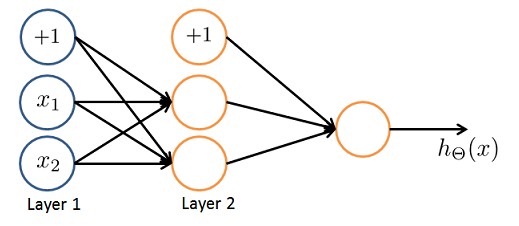

# Neural Networks Quiz

## Q1 Which of the following statements are true? Check all that apply.

* [x] Any logical function over binary-valued (0 or 1) inputs $x_1$​ and $x_2$ can be (approximately) represented using some neural network.
* [ ] A two layer (one input layer, one output layer; no hidden layer) neural network can represent the XOR function. `no, need hidden layer`
* [x] The activation values of the hidden units in a neural network, with the sigmoid activation function applied at every layer, are always in the range (0, 1). `i dont think so, because sigmoid is within0-1 but the inputs can be much larger --> second try: the question was about the sigmoid :)`
* [ ] Suppose you have a multi-class classification problem with three classes, trained with a 3 layer network. Let $\ssb{a}{3}_1 = (\hTx)_1$ be the activation of the first output unit, and similarly $\ssb{a}{3}_2 = (\hTx)_2$ and $\ssb{a}{3}_3 = (\hTx)_3$. Then for any input $x$, it must be the case that $\ssb{a}{3}_1+\ssb{a}{3}_2+\ssb{a}{3}_3​=1$. `no, the sum of the output cells must be 1`

## Q2 
Consider the following neural network which takes two binary-valued inputs $x_1, x_2 \in \{0,1\}$ and outputs $\hTx$. Which of the following logical functions does it (approximately) compute?

(image of AND such as in the slides)

* AND

## Q3 
Consider the neural network given below. Which of the following equations correctly computes the activation $\ssb{a}{3}_1$ Note: $g(z)$ is the sigmoid activation function.


`Selected #4 -> use elements from the previous layer, ie `$g(\T{2,0}^{(2)}\ssb{a}{2}_0 + ...)$

` Second try: we indeed need to use `$\Ts{2}$ `, but eleemnts 1,0, 1,1 and 1,3, so the correct answer is the first one`

## Q4 You have the following neural network: (image) 


You'd like to compute the activations of the hidden layer $\ssb{a}{2} \in \RR^3$. One way to do so is the following Octave code:

 

You want to have a vectorized implementation of this (i.e., one that does not use for loops). Which of the following implementations correctly compute $\ssb{a}{2}$? Check all that apply.

```matlab
* [x] z = Theta1 * x; a2 = sigmoid (z); 
* [ ] a2 = sigmoid (x * Theta1); % the order is not correct
* [ ] a2 = sigmoid (Theta2 * x); % no because this is to calc layer 3
* [ ] z = sigmoid(x); a2 = sigmoid (Theta1 * z); % def no
```

## Q5
You are using the neural network pictured below and have learned the parameters $\Ts{1} = \mat{1 & 1 & 2.4 \\ 1 & 1.7 & 3.2}$ (used to compute $\ssb{a}{2}$) and $\Ts{2} = \mat{1 & 0.3 & -1.2}$ (used to compute $\ssb{a}{3}$} as a function of $\ssb{a}{2}$). Suppose you swap the parameters for the first hidden layer between its two units so $\Ts{1} = \mat{1 & 1.7 & 3.2 \\ 1 & 1 & 2.4}$ and also swap the output layer so $\Ts{2} = \mat{1 & -1.2 & 0.3}$. How will this change the value of the output $\hTx$?



* [x] It will stay the same.
* [ ] It will increase.
* [ ] It will decrease
* [ ] Insufficient information to tell: it may increase or decrease.
