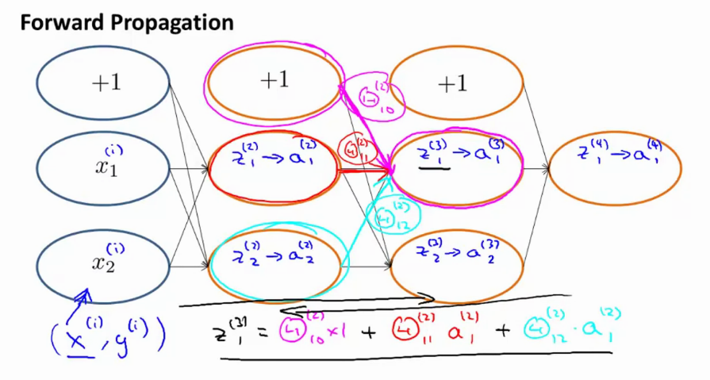
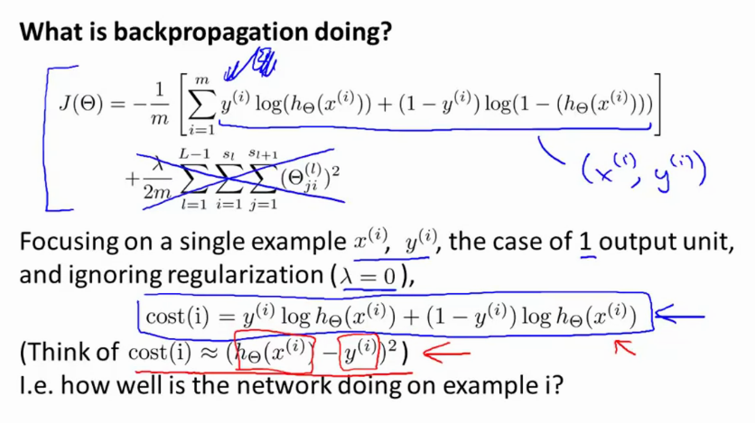
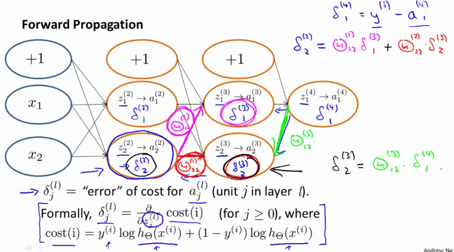
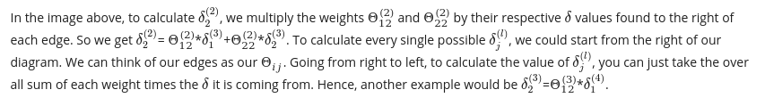
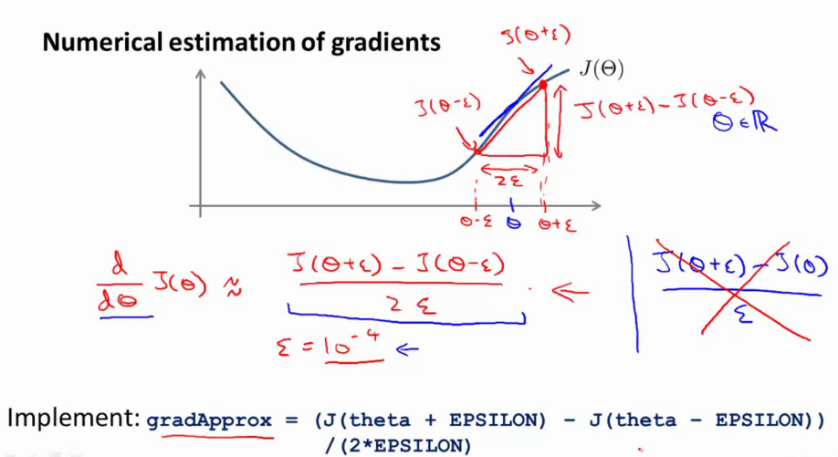
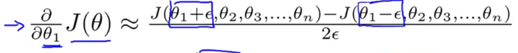

# Week 5 notes: Neural networks - learning

More general notes can be found [on the coursera website](https://www.coursera.org/learn/machine-learning/resources/EcbzQ)

## Cost Function

Lets make a neural network

* training set $\trainingSetGeneric$
* $L$ = number of layers in the network
    * $L=4$
* $s_l$ = number of units (not counting bias) in layer $l$
    * $s_1 = 3, s_2 = 5, s_4=s_l=4$
* $\hTx_k$ is the hypothesis that results in the $k^{th}$ output. 

Lets look at two types of classification problems

### Binary Classification

* $y = 0$ or $1$ 
* 1 output unit 
* $\hTx \in \RR$
* $s_L = 1$ 
* $K=1$

### Multiclass classification (K classes) 

* $y \in \RR^K$, eg $\underbrace{\hTx = \mat{1 \\ 0 \\ 0 \\ 0}}_{car} \underbrace{\hTx = \mat{0 \\ 1 \\ 0 \\ 0}}_{person} \underbrace{\hTx = \mat{0 \\ 0 \\ 1 \\ 0}}_{dog} \underbrace{\hTx = \mat{0 \\ 0 \\ 0 \\ 1}}_{motorcycle}$
* K output units
* $\hTx \in \RR^K$
* $s_L = K$ with $K \geq 3$

Go back to logistic regression

$$\logrCostLongReg$$

For a NN, we will make a generalization of this, that works with K output units. Initially, lets update the brackets

$$\nnCostGeneric$$

$\hTx \in \R^K$ so that $(\hTx)_i = i^{th}$ output. Now, the inner sum is just a sum over the $K$ output units, see it as four classifiers being added up. 

A second term is the regularization term, which sums over all values of $i, j, l$ (thus accounting for each of the $\T{}$ matrices), ignoring places where any of them $=0$ (bias). 

$$ \nnCostRegularizer $$

The number of columns in our current $\T{}$ matrix is equal to the number of nodes in our current layer (including the bias unit). The number of rows in our current theta matrix is equal to the number of nodes in the next layer (excluding the bias unit).

In totality, the cost function becomes

$$\nnCostGeneric + \nnCostRegularizer$$

Notes: 

* the double sum simply adds up the logistic regression costs calculated for each cell in the output layer
* the triple sum simply adds up the squares of all the individual $\T{}$ in the entire network.
* the $i$ in the triple sum does not refer to training example $i$

## Backpropagation

We need to $\undersetnorm{min}{\T{}} J(\T{})$, so we need code to compute the `cost` and the `partial derivatives`.

Given one training example ($x,y$): 


Forward propagation: 

* $\ssb{a}{1} = x$ 
* $\ssb{z}{2} = \Ts{1}\ssb{a}{1}$
* $\ssb{a}{2} = g(\ssb{z}{2}) \quad \textnormal{add}\quad \ssb{a}{2}_0$
* $\ssb{z}{3} = \Ts{2}\ssb{a}{2}$
* $\ssb{a}{3} = g(\ssb{z}{3}) \quad \textnormal{add}\quad \ssb{a}{3}_0$
* $\ssb{z}{4} = \Ts{3}\ssb{a}{3}$
* $\ssb{a}{4} = \hTx = g(\ssb{z}{4})$

### Intuition

* $\delta_j^{(l)}$ = "error" of node $j$ in layer $l$.

For each output unit (layer $L=4$):

$$\ssb{\delta}{4}_j = \underbrace{\ssb{a}{4}_j}_{\hTx_j} - y_j \Ra \ssb{\delta}{4} = \ssb{a}{4} - y$$

and we continue doing this for the earlier layers in our network. Note that $.*$ is elementwise multiplication, and $1$ is a *one-vector*.

$$\ssb{\delta}{3}_j = (\Ts{3})^T\ssb{\delta}{4}.*\underbrace{g'(\ssb{z}{3})}_{\ssb{a}{3}.*(1-\ssb{a}{3})}$$

$$\ssb{\delta}{2}_j = (\Ts{2})^T\ssb{\delta}{3}.*g'(\ssb{z}{2})$$

The name backprop comes from the idea that you start from the end and work back to the front, effectively pushing the errors back to the front.

If you **ignore the regularization term**, we can note that 

$$ \frac{\delta}{\delta\Ts{l}_{ij}}J(\T{}) = \ssb{a}{l}_j\ssb{\delta}{l+1}_{i}$$

### Algorithm

Given a training set

$$\trainingSetGeneric$$

Set $\ssb{\Delta}{l}_{ij} = 0$ for all $l, i, j$ to compute the partial derivative term $\frac{\delta}{\delta\Ts{l}_{ij}}J(\T{})$:

For $i=1$ to $m \leftarrow (x_i, y_i)$

* Set $\ssb{a}{1} = \ssb{x}{i}$
* Perform formward propagation to compute $\ssb{a}{l}, l \in 2, 3, .., L$
* Using $\ssb{y}{i}$, compute $\ssb{\delta}{L} = \ssb{a}{L} - \ssb{y}{i}$
* Work your way back by computing $\ssb{\delta}{L-1}, \ssb{\delta}{L-2}, ..., \ssb{\delta}{2}$ (no $\ssb{\delta}{1}$ because thats the input)
* $\ssb{\Delta}{l}_{ij} := \ssb{\Delta}{l}_{ij} + \ssb{a}{l}_j\ssb{\delta}{l+1}_i$

* In a vectorized way: $\ssb{\Delta}{l} := \ssb{\Delta}{l} + \ssb{\delta}{l+1}(\ssb{a}{l})^T$

After exeucting this for loop, we compute the following

* $\ssb{D}{l}_{ij} := \frac{1}{m}\ssb{\Delta}{l}_{ij} + \lambda\Ts{l}_{ij}$ if $j \neq 0$
* $\ssb{D}{l}_{ij} := \frac{1}{m}\ssb{\Delta}{l}_{ij} \quad\quad\quad\quad$ if $j = 0$

And it can be proven that the partial derivative is equal to these terms $\nnPartial = \ssb{D}{l}_{ij}$.

For more than one training sample, we do (Forward prop, backward prop) for the first sample, followed by the same for the second sample.

## Backprop intuition



* $\Ts{2}_{11}$ is the weight of 2 -> 3

What is backprop doing? 



* the cost function is about the squared error cost function

Forward propagation

The cost function is function of the label $y$ and the value $\hTx$, the output of the network. The difference can be noted by the $\delta$ terms (partial derivatives of the cost function with respect to the intermediate terms), so if we change them slightly the costfunction changes slightly and thus the output.

Once again, start from the back 

* $\ssb{\delta}{4}_1 = \ssb{y}{i} - \ssb{a}{4}_1$ which is the output of the outcome with the label
* backprop is similar to forward prop, instead of taking multiple values and combining them in a weighted sum, we do it in the opposite direction. literally the same.




`We also caluclate the delta terms for the bias units, but we end up dropping them as they dont have an effect in the total.`

## Implementation note: unrolling parameters

```matlab

function [jVal, gradient] = costFunction(theta) 
    % assumes theta are vectors
    ...

optTheta = fminunc(@costFunction, initialTheta, options)


%% In neural networks, these are no longer vectors but matrices. 
% we can just unroll the matrices into vectors and use the same idea. 


```

Example

* $s_1 = 10, s_2 = 10, s_3 = 1$: hidden units in network
* Dimensions: 
    * $\Ts{1} \in \RR^{10x11}, \Ts{2} \in \RR^{10x11}, \Ts{3} \in \RR^{1x11}$
    * $\ssb{D}{1} \in \RR^{10x11}, \ssb{D}{2} \in \RR^{10x11}, \ssb{D}{3} \in \RR^{1x11}$

```matlab
thetaVec = [Theta1(:); Theta2(:); Theta(3)]; %unroll all in vec
DVec = [D1(:); D2(:); D3(:)];  %unroll all in vec

% to go back to the matrix, you can use reshape

Theta1 = reshape(thetaVec(1:110), 10, 11);
Theta1 = reshape(thetaVec(111:220), 10, 11);
Theta1 = reshape(thetaVec(221:231), 1, 11);
```

Learning algorithm

* Have initial parameters $\Ts{1}, \Ts{2}, \Ts{3}$. 
* Unroll to get initialTheta to pass to
* fminunc(@costFunction, intialtheta, options)

```matlab

function [jVal, gradient] = costFunction(thetaVec)
    % from thetaVec, get T1, T2, T3
    %use forawrd/backprop to compute D1, D2 and D3 and J
    %unroll D1, D2, D3 to get gradientVec
```

## Gradient Checking

Numerical estimation of gradients: imagine we have to find the gradient at some point in a random curve. We can sample the proximity of that point and find the derivatives between the actual point and the sampled point. 

In other words, if we have a point $\T{}$, we can find multiple other points $\T{} - \epsilon$ and $\T{} + \epsilon$. The derivative can be calculated from the line connecting the two points. $\epsilon = 10^{-4}$ or so. `Note, the two sided difference gives us a better estimate than the onesided difference`.



Imagine a parameter vector $\t{} \in \RR^n$ ($\t{}$ might be an unrolled vector of a collection of $\Ts{j}$) 

$$ \t{} = \t{1}, \t{2}, \t{3}, ... \t{n} $$

We can then use a similar idea to compute all partial derivative terms, where we increase the cost $J$ of parameter $\t{j}$ by $\epsilon$.



Concretely, what we implement is the following

```matlab
for i = 1:n
    thetaPlus = theta;
    thetaPlus(i) = thetaPlus(i) + EPSILON;
    thetaMinus = theta;
    thetaMinus(i) = thetaMinus(i) - EPSILON;
    gradApprox(i) = (J(thetaPlus) - J(thetaMinus)) / (2*EPSILON);
```

Then, we can assert that `gradApprox ~= DVec`. If these values are really close, we can be sure that our backprop is correct and the derivatives are correct. `This is probably not that important anymore as we have autograd..`

**After you have checked your gradients, make sure to turn the gradient checking off because it will make your code VERY slow.**

## Random initialization

If you initialize all of your parameters to zero, all of the theta's will become equal to eachother. After each update the paramters correspondig to inputs going into each of two hidden units are identical. Your two hidden units are still calculating the exact same function as your input. Your neural network in this case can not calculate very interesting functions, because all of the weights are exactly the same. This is a highly redundant representation. 

### Symmetry breaking

In order to get around this problem, we use random initialization. We intiialize each value of theta to a random value between $[-\epsilon , +epsilon]$. 

```matlab
Theta1 = rand(10,11) * 2*INIT_EPSILON - INIT_EPSILON; 
Theta2 = rand(1,11)*2*INIT_EPSILON - INIT_EPSILON; 
```

## Putting it together

To train a network, we first need to pick an `architecture`.
The number of input units is the `dimension of features `$\ssb{x}{i}$. 
The number of output units is the `number of classes`.
Usually, the hidden layers have the `same amount of hidden units in each layer`, and `the more hidden units the better`.

Training a neural network steps: 

* Randomly initialize weights
* Implement forward prop to get $\hTxi$ for any $\ssb{x}{i}$. 
* Implement code to compute cost function $J(\T{})$
* Implement backrpop to compute partial derivatives $\nnPartial$. such as below

```matlab
for i=1:m
    % perform forward prop followed by a backwrad prop on example i
    % Get activations a and delta terms d for each layer l.

% compute partialderivatives including regularization terms
```

* Next, use gradient checking to compare $\nnPartial$ from backrpop vs numerical estimation of $J(\T{})$.
* Finally, use GD or any other advanced optimization method with backprop to try to $\undersetnorm{min}{J(\T{})}$. `This J is not convex and so you can get stuck in local optima! However, GD usually works kinda well`

To check GD is working correctly, plot $J(\T{})$ as a function of the number of iterations and make sure its decreasing (or non increasing) with every iteration.
