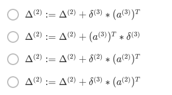

# Neural Networks: Learning

## Q1

You are training a three layer neural network and would like to use backpropagation to compute the gradient of the cost function. In the backpropagation algorithm, one of the steps is to update

* $\ssb{\Delta}{2}_{ij} := \ssb{\Delta}{2}_{ij} + \ssb{\delta}{3}_i*(\ssb{a}{2})_j$

for every $i,j$. Which of the following is a correct vectorization of this step?



from notes: In a vectorized way: $\ssb{\Delta}{l} := \ssb{\Delta}{l} + \ssb{\delta}{l+1}(\ssb{a}{l})^T$

That means that we need $\delta^{(3)}*(\ssb{a}{2})^T$

## Q2

Suppose Theta1 is a 5x3 matrix, and Theta2 is a 4x6 matrix. You set thetaVec=[Theta1(:);Theta2(:)]. Which of the following correctly recovers Theta2?

```matlab
theta1 = ones(5,3);
theta2 = 2*ones(4,6);
thetaVec = [theta1(:); theta2(:)];

theta2_recoved = reshape(thetaVec(16:39), 4, 6);
```

## Q3 

Let $J(\T{}) = 3\t{}^3 + 2$. Let $\t{}=1$, and $\epsilon=0.01$. Use the formula $\frac{J(\T{} + \epsilon) - J(\T{} - \epsilon)}{2\epsilon}$ to numerically compute an approximation to the derivative at $\t{} = 1$. What value do you get? (When $\t{} = 1$, the true/exact derivative is $\nnPartial = 9$.)

* [ ] 11
* [ ] 9
* [ ] 8.9997
* [x] 9.0003

Compute

$$ \frac{(3*(1.01)^3 + 2) - (3*(0.99)^3 + 2)}{2*0.01} = 9.0003$$

## Q4
Which of the following statements are true? Check all that apply.

* [ ] Gradient checking is useful if we are using gradient descent as our optimization algorithm. However, it serves little purpose if we are using one of the advanced optimization methods (such as in fminunc). `not true its always good to do a sanity check`
* [x] If our neural network overfits the training set, one reasonable step to take is to increase the regularization parameter $\lambda$. 
* [ ] Using a large value of $\lambda$ cannot hurt the performance of your neural network; the only reason we do not set $\lambda$ to be too large is to avoid numerical problems.  `no, we will underfit the training set if lambda is too big`
* [x] Using gradient checking can help verify if one's implementation of backpropagation is bug-free.

## Q5
Which of the following statements are true? Check all that apply.

* [x] Suppose we have a correct implementation of backpropagation, and are training a neural network using gradient descent. Suppose we plot $J(\T{})$ as a function of the number of iterations, and find that it is increasing rather than decreasing. One possible cause of this is that the learning rate $\alpha$ is too large. `true, we jump over the minimum`

* [x] If we are training a neural network using gradient descent, one reasonable "debugging" step to make sure it is working is to plot $J(\T{})$ as a function of the number of iterations, and make sure it is decreasing (or at least non-increasing) after each iteration. `yep, as in notes`

* [ ] Suppose we are using gradient descent with learning rate $\alpha$. For logistic regression and linear regression, $J(\T{})$ was a convex optimization problem and thus we did not want to choose a learning rate $\alpha$ that is too large. For a neural network however, $J(\T{})$ may not be convex, and thus choosing a very large value of α\alphaα can only speed up convergence. `def not true`

* [ ] Suppose that the parameter $\Ts{1}$ is a square matrix (meaning the number of rows equals the number of columns). If we replace $\Ts{1}$ with its transpose $(\Ts{1})^T$, then we have not changed the function that the network is computing. `not true, computing a2 or z2 will give a different value (matmul order is important)`