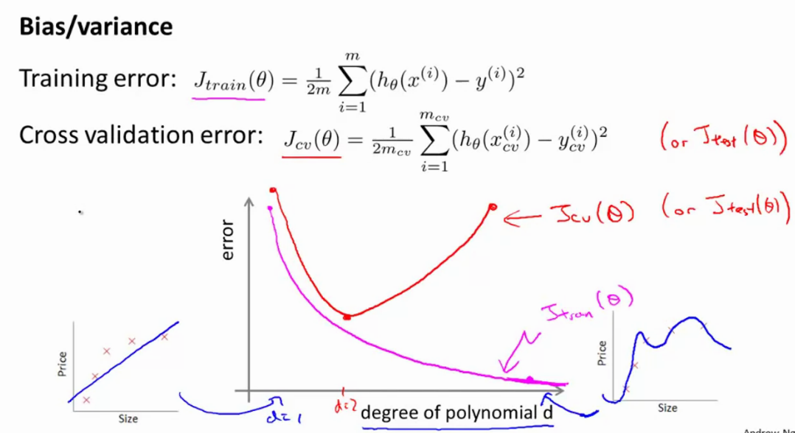
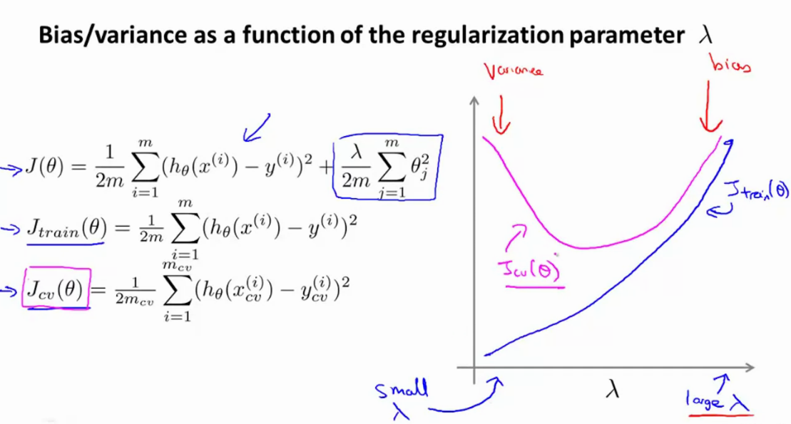
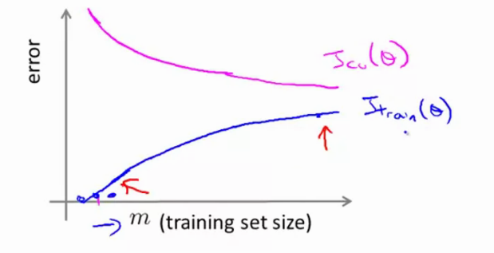

# Week 6 notes

More general notes can be found [on the coursera website](https://www.coursera.org/learn/machine-learning/resources/LIZza)

## Deciding what to try next

* Imagine you have an algo to predict housing prizes but you suck on real data, you can solve it by maybe trying one of these
    * get more data (can fail)
    * try a smaller set of features (reduce redundancy to prevent overfitting)
    * try get additional features
    * add polynomial features
    * decreasing / increasing $\lambda$ (regularization parameter)

Most ppl will go by "gut feeling".

However, theres a simple technique that you can use to rule out many of these options, Machine Learning Diagnostics. Diagnostics can take time to implement, but can be very useful because they can often save you from months of experimentation.

## Evaluating a hypothesis

* Fails to generalize to examples not in training set
* imagine $x_1, x_2 , ... x_{100}$
    * split dataset into train / test set 70-30 ($m_{test}$ = num of test examples)
    * apply random shuffle
* Learn parameters $\t{}$ from training data (ergo $\undersetnorm{min}{J_{train}}$)
* Compute the test set error by calculating the cost on the test examples $x_m$. 
* A different error could be the misclassification error (you get an example right / you get an example wrong). Imagine 10 classes, if you get the right number you get 1, else you get 0. Take the sum of this and divide by the number of test samples $m_{test}$.

## Model selection and Train/Val/Test sets

* The problem of overfitting has been established.
* Training set error is not a good metric to evaluate quality of the system.

### Model selection

* what degree ($d$) of polynomial do you want to pick (i.e. $d=1,2,...10$)
* You could fit each of the models and evaluate all of the test errors, choosing the one that has the lowest test set error. However, this cost is probably an optimistic estimate.
* Introduce a new part: a (cross)validation set. Now we have a training set, validation set and test set.
* Now use the validation set error to select the model. Finally, once chosen, evaluate error on test set.

## Diagnosing Bias vs Variance

* Underfitting (bias) vs overfitting (variance)

Hypotheses

* too simple hypothesis -> underfit (high bias)
* too complex hypothesis -> overfit (high variance)

Bias/variance

* Remember training error / validation error.
* Plot the training error/validation error versus the degree of the chosen polynomial of the hypothesis.
* For the training set, the more complex the hypothesis the lower the error will be.
* For the validation set, we have a minimum somewhere (optimum).
 

A high bias problem is where $d$ is too small for the dataset, and so the validation error and training error will be high ($J_{val} ~= J_{train}$)

A high variance problem is where $d$ is too large for the dataset, and so the training error will be very low but the validation error is very high ($J_{val} >> J_{train}$).

## Regularization and bias/variance

* Suppose we fit a high order polynomial, but to prevent overfitting we add a regularization term.
* If our regularization is too large ($\lambda$ >>>), we will get a high bias because all of the parameters are nearly 0.
* If our regularization is too small ($\lambda$ <<<<), we will get a high variance because theres actually minimal / no regularization.
* Good lambda makes a big difference.

How do we choose a good value for the regularization parameter $\lambda$? 

* Try a range of lambda i.e. $\lambda = 0, 0.1, 0.02, 0.04, 0.08, ..., 10$). You get a bunch of models, and for each of these evaluate the costs $J_{val}, J_{train}$, next choose the lowest validation error. Finally, evaluate on the test set.

* For small values of lambda, you dont have regularization, so you will fit the train set well, but val set error will be big. If you have a large value of lambda, you will not fit your training set well and your val set will be similar because all of the params are 0.

## Learning curves

Imagine 

$$\Jtrain$$ 
$$\Jval$$

and plot the error in function of the value $m$, i.e. training set size, but LIMIT yourself to a subset of the training set.

* If the training set size is small, the training error will be really small too.
* If the training size grows, the training set error will grow with $m$. (Intuition: if you only have 1 or 2 training samples, it will be easy to get 0 error, but if you increase the size of the set you will get to a point where you can no longer ensure 0 error.)

Now imagine alot more training examples. If the hypothesis is too simple, the validation set error will remain constant (plateau) pretty soon. The training set error will start off small, and the training error will end up close to the validation error. (high bias) This is very problematic if the error is actually high.

`If a learning algo is suffering from high bias, getting more training data will not help much!`

`If a learning algo is suffering from high variance, the difference between training error and val error will be big (a gap), and getting more training data will likely improve the model.`

## Deciding what to do next revisited

Debugging a learning algo:

* get more training examples --> `helps to fix high variance, but not in high bias!`
* try smaller set of features --> `helps to fix high variance, but dont even try this if you have a high bias problem`
* try getting additional features --> `helps to fix high bias problems, as your current hypothesis is too simple.`
* try adding polynomial features --> `helps to fix high bias problems, ssimilar to above`
* decreasing / increasing lambda --> `decreasing lambda helps to fix high bias, increasing lambda helps to fix high variance.`

Neural networks and overfitting:

* small neural network: few parameters, more prone to underfitting ,computationally cheap
* large neural network: more parameters, more prone to overfitting, computationally expensive. Use regularization ($\lambda$) to address overfitting. `often the larger the better`. Usually, using one hidden layer is default & ok, but you can try more to see how it performs on the validation set.

`To evaluate the different lambda parameters, use lambda to train the network but during inference leave out this parameter (ie set it to 0)`