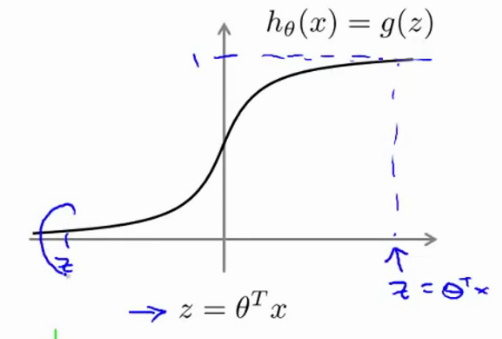
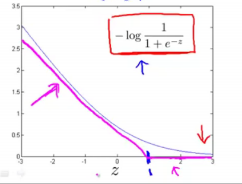
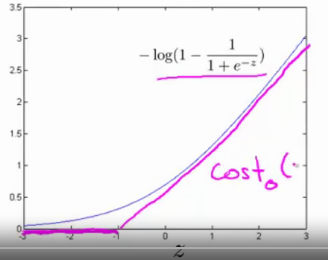
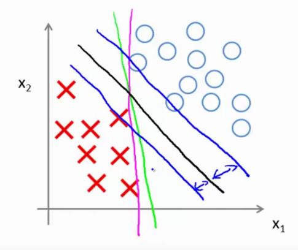
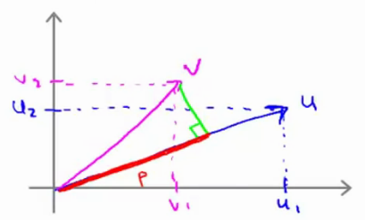
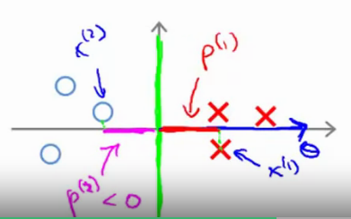
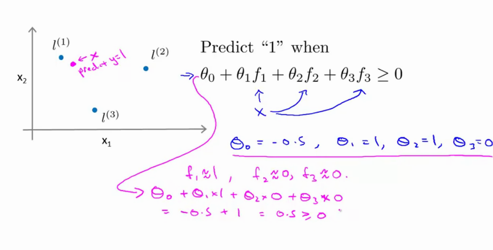

# Week 7 Notes - SVM's

More general notes can be found [on the coursera website](https://www.coursera.org/learn/machine-learning/resources/Es9Qo)

## Optimization Objective

SVM is also a complex non-linear learning algorithm

Starting from Logistic Regression, where we have

$$\sigmoid = \sigmoidT$$

If $y=1$ we want $\htx ~= 1$, so $\t{}^Tx \gt \gt 0$. 



The cost function has a term for each training example. 

$$\logrCostFull$$

If we take the above definition of $\htx$ and plug it into the cost function, we get:

$$\logrCostFullSigmoid$$

If Z becomes really big, the cost goes down to zero. Now, teh cost function becomes two line segments as the purple line below.



This purple function we call

$$ \textnormal{Cost}_1 z$$
$$ \textnormal{Cost}_0 z$$



## Support vector machine cost

$$ \undersetnorm{min}{\t{}} \frac{1}{m} \sum_{i=1}^{m} \Bigg[y^{(i)} \textnormal{cost}_1(\T{}^Tx^{(i)}) + (1-y^{(i)})\textnormal{cost}_0(\T{}^Tx^{(i)})\Bigg] + \frac{\lambda}{2m} \sum_{i=0}^{n} \t{j}^2$$

Rewriting it a bit, by getting rid of the 1/m term (constant), and changing $a+\lambda*b$ by  $c*a + b$, where $C = \frac{1}{\lambda}$

$$\costSVM$$

Hypothesis will predict 1 if $\T{}^Tx\geq0$ and 0 otherwise.

## Large margin intuition

$$ \textnormal{Cost}_1 z = 0 \ra \t{}^Tx \geq 1$$

$$ \textnormal{Cost}_0 z = 0 \ra \t{}^Tx \leq -1$$

We want $\t{}^Tx \geq 1$, not just $\geq 0$. 

If C in below equation is very big and we want the first term in brackets to become zero, we need the hypothesis to adhere to the above constraints.

$$\costSVM$$

Whenever $\ssb{y}{i} = 1$

$$\textnormal{min} C*0 + \frac{1}{2}\sum_{i=1}^{n}\t{j}^2$$

So $\t{}^Tx \geq 1$ if $\ssb{y}{i} = 1$, and $\t{}^Tx \leq -1$ if $\ssb{y}{i} = 0$



The black line is the most optimal one, as it has a larger distance seperating the classes. This distance is called the `margin` (blue arrows). In other words, a SVM is a large margin classifier.

If the regularization parameter C is very large, outliers will distort the decision boundary hard. In the presence of outliers, the size of C should be small enough.

## Mathematics behind Large Margin Clsasification

Given two vectors $u, v$. 

$$u = \mat{u_1\\u_2} v = \mat{v_1 \\ v_2}$$

What is $u^Tv$?

$|| u ||$ is the length of the vector u, i.e. $\sqrt{u_1^2 + u_2^2} \in \RR$.



$p$ (red) is the magnitude of the projection of the vector $v$ on the vector $u$.

$$u^Tv = p\cdot||u|| = u_1v_1 + u_2v_2 = v^Tu$$

$p$ has a sign (direction) can be positive/negative.


The SVM Decision boundary

$$\undersetnorm{min}{\t{}} \frac{1}{2}\sum_{j=1}^{n}\t{j}^2$$

Where 

* $\t{}^T\ssb{x}{i} \geq 1$ if $\ssb{y}{i} = 1$
* $\t{}^T\ssb{x}{i} \leq -1$ if $\ssb{y}{i} = 0$

If there are only two terms ($n=2$), and $\t{0}=0$, then we can simplify to:

$$\undersetnorm{min}{\t{}} \frac{1}{2}\sum_{j=1}^{n}\t{j}^2 = \frac{1}{2}(\t{1}^2 + \t{2}^2) = \frac{1}{2}\Big(\underbrace{\sqrt{\t{1}^2 + \t{2}^2)}}_{||\t{}||}\Big)^2$$

$\t{}^T\ssb{x}{i} = u^Tv = ?$


This means we can update: 

* $\ssb{p}{i} \cdot ||\t{}|| \geq 1$ if $\ssb{y}{i} = 1$
* $\ssb{p}{i} \cdot ||\t{}|| \leq -1$ if $\ssb{y}{i} = 0$

Where $\ssb{p}{i}$ is the projection of $\ssb{x}{i}$ onto the vector $\t{}$. (perpendicular)


If $\ssb{p}{i} \cdot ||\t{}||$ , and $\ssb{p}{1}$ is small then the norm has to be large. `We are looking for something where the norm of theta is small! `

Lets take a different norm



because $\ssb{p}{1}$ is now bigger, the norm can be smaller. Now thers a large gap (large margin) that seperates the values. By making $\ssb{p}{1}, \ssb{p}{2} ,...$ larger, we are maknig the gap larger.

## Kernels

* To adapt SVM's to manage more complex functions, we use kernels.
* For example a circle or something similar.
* Introduce a new notation where 

$$\htx = \t{0} + \t{1}f_1 + \t{2}f_2 + .... + \t{3}f_3$$

* where $f$ become the features, such as $x_1 ,..$
* given $x$, compute new feature depending on proximity to landmarks $\ssb{l}{1}, \ssb{l}{2}, ...$
* given $x$: 

$$f_1 = \textnormal{similarity}(x, \ssb{l}{i}) = \textnormal{exp}(-\frac{\overbrace{||x-\ssb{l}{1}||^2}^{\textnormal{component wise distance between x and l}}}{2\sigma^2})$$

The similarity function is called a kernel, in this case a Gaussian kernel

$$ \textnormal{similarity}(x, \ssb{l}{i}) = k(x,\ssb{l}{i})$$

$$ f_1 = \textnormal{exp}(-\frac{||x-\ssb{l}{1}||^2}{2\sigma^2}) = \textnormal{exp}\Big(-\frac{\sum_{j=1}^{n}(x_j - \ssb{l}{1}_j)^2}{2\sigma^2}\Big)$$

If $x$ is now close to one of the landmarks $l$, then the distance between x and l will be close to zero, so the feature $f_1$ will be about equal to 

$$\textnormal{exp}(-\frac{\textnormal{0}^2}{2*\sigma^2})  ~= 1$$

If $x$ is far from $\ssb{l}{1}$, the result will be 

$$\textnormal{exp}(-\frac{\textnormal{large\_number}^2}{2*\sigma^2}) ~= 0$$

You get a gaussian like the following


If $x = \mat{3\\5}$, we have the maximum (1). If x moves away, we get closer to zero.

$\sigma$ is the size of the Gaussian, the bigger this value the wider the gaussian.

$$ f_1 = \textnormal{exp}(-\frac{||x-\ssb{l}{1}||^2}{2\underbrace{\sigma^2}_{\textnormal{defines the size of the gaussian}}}) $$

Example




So the points need to be close to $\ssb{l}{1}, \ssb{l}{2}$ to get $y=1$. The decision boundary then becomes


* how do we find the landmarks?
* how can we use other similarities besides gaussians

### Choosing the landmarks

* Choose landmarks $l$ to be equal to the location of each of the training examples $x$, ie. given $m$ training examples, choose $\ssb{l}{i} = \ssb{x}{i}$, ... 
    * Given $x$: 
    * $f_1$ = similarity($x, \ssb{l}{1}$)
    * $f_2$ = similarity($x, \ssb{l}{2}$)
    * so we get $f = \mat{f_0 \\f_1 \\...\\f_n}$ and $f_0 = 1$

For training example $(\ssb{x}{i}, \ssb{y}{i})$:

* $\ssb{x}{i} \ra \mat{f_0 = \textnormal{sim}(\ssb{x}{i}, \ssb{l}{1}) \\ f_1=\textnormal{sim}(\ssb{x}{i}, \ssb{l}{2}) \\ f_2=\textnormal{sim}(\ssb{x}{i}, \ssb{l}{3})\\ ... \\ f_n=\textnormal{sim}(\ssb{x}{i}, \ssb{l}{n})} \in \RR^{n+1}$
* given $x$, compute features $f \in \RR^{m+1}$ (m training exampels = m landmarks)
* predict $y=1$ if $\t{}^Tf \geq 0 \ra \t{0}f_0 + \t{1}f_1 +...$
* predict $y=0$ if $\t{}^Tf \lt0$
* Training:

$$\costSVM$$

where $\T{}^T\ssb{x}{i}$ becomes $\t{}^T\ssb{f}{i}$, and n becomes $m$ as we have $m$ training samples.

$$\costSVMkernel$$

In implementation, we change the regularization parameter to 

$$\frac{1}{2}\sum_{j=1}^m \t{j}^2 = \t{}^TM\t{}$$

which means that we do not minimzie the norm of theta, but a slightly different one which allows the SVM software to calculate it alot more efficiently and allows for better scaling (i.e. computationally efficiency).

`You can apply the kernel idea to other algorithms as well, but the computational tricks do not work very well with other algo's. In other words, it will be very slow.`

#### Choosing SVM Paramters

Regularization

* $C=\frac{1}{\lambda}$.
* Large C (little regularization): lower bias, high variance. (more prone to overfitting)
* Small C (large regularization): higher bias, low variance. (more prone to underfitting)

Sigma

* $\sigma^2$
* Large $\sigma^2$: features $f_i$ vary more smoothly. Higher bias, lower variance. (gaussian kernel falls off more smoothly (gets wider)).
* small $\sigma^2$: features $f_i$ vary abruptly. Higher variance, lower bias. (gaussian falls off very rapidly).

If you have a problem that is overfitting on the training data, decreasing $C$ and increasing $\sigma^2$ would be reasonable steps.

### Using an SVM

* Use a software package to solve for parameters $\t{}$.
* Need to specify: 
    * choice of parameter C
    * choice of kernel (no kernel = linear kernel, $y=1 \ra \t{}^Tx\geq0$, if the number of features $n$ is large and the number of samples $m$ is low)
    * Gaussian kernel  $f_1 = \textnormal{exp}(-\frac{||x-\ssb{l}{1}||^2}{2\sigma^2})$

```matlab

% compute fi
function f = kernel(x1,x2)
    f = exp(-||x1-x2||^2 / 2*sigma^2); 
return
```

`Note: Use feature scaling if you use Gaussian kernel!!`

* $||x-l||^2  \ra v=x-l \quad\textnormal{and}\quad ||v||^2 = v_1^2 + v_2^2 + .. + v_n^2 = (x_1 - l_1)^2 + .. + (x_n -l_n)^2$
* if x1 is in the range 0-1000 and x2 in the range 0-5, we will only focus on a single feature. That's why you use feature scaling.

* By far the most common kernels are linear / gaussian.
* You can't just use anything as similarity function, the functions you model have to satisfy "Mercer's Theorem" (optimization related).
* Other kernels: polynomial kernel ($k(x,l) = (x^Tl)^2, (x^Tl)^3, (x^Tl+1)^3$) etc, so actually $x^Tl + constant$. Commonly sucks gaussian is better.
* esoteric kernels: string kernel (text classification), chi-square kernel, histogram intersection kernel. ......

### Multi-class classification

* $y \in \{1,2,3 , ... , K\}$
* most libraries have multi class support
* if you don't you can use One-vs-all methods (train K SVMS, one for distinguishing each class, get all of the outputs and pick the class $i$ that has the largest $(\ssb{\t{}}{i})^Tx$

Logistic regression vs SVMs

* $n$ = number of features
* $m$ = number of samples
* if $n$ is large (relative to $m$), use logistic regression or SVM without kernel. ($n=10000, m=10-1000$)
* if $n$ is small and $m$ is intermediate, use SVM with gaussian kernel ($n=1-1000, m=10-10000$)
* if $n$ is small and $m$ is large: add more features, then use logistic regression or SVM without a kernel. $n=1-1000,m=50000+$
* logistic regression and svm without kernel are pretty similar.
* NN probably works for everything but might be slower to train.
* SVM optimization is a convex problem, so svm's dont have local optima.

