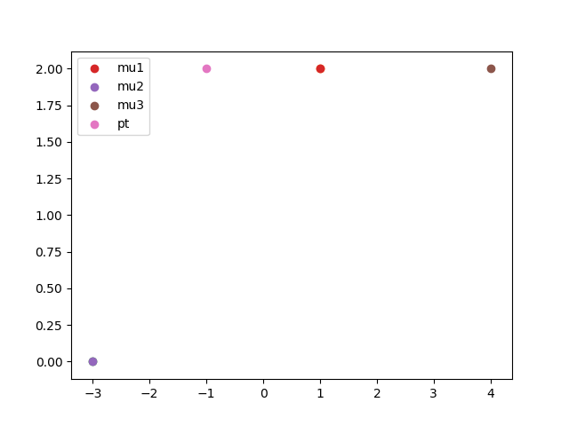
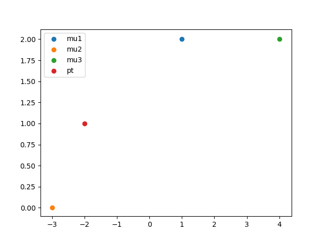

# Quiz unsupervised learning

## q1

For which of the following tasks might K-means clustering be a suitable algorithm? Select all that apply.

* [x] Given a set of news articles from many different news websites, find out what are the main topics covered. `I guess it could be a 2 cluster`

* [x] From the user usage patterns on a website, figure out what different groups of users exist.

* [ ] Given historical weather records, predict if tomorrow's weather will be sunny or rainy.

* [ ] Given many emails, you want to determine if they are Spam or Non-Spam emails.`this requires labels`

## Q2

Suppose we have three cluster centroids $\mu_1 = \mat{1\\2}, \mu_2 = \mat{-3\\0}, \mu_3 = \mat{4\\2}$. Furthermore, we have a training example $\ssbi{x} = \mat{-1\\2}$. After a cluster assignment step, what will $\ssbi{c}$ be?

`closest point = 1, 2. can also be calculated ||x-mu||`

` second try the point is [-2, 1], so the selected cluster is c=2`

## q3

K-means is an iterative algorithm, and two of the following steps are repeatedly carried out in its inner-loop. Which two?

* [x] Move the cluster centroids, where the centroids $\mu_K$ are updated.

* [ ] The cluster centroid assignment step, where each cluster centroid $\mu_i$ is assigned (by setting $\ssbi{c}$ to the closest training example $\ssbi{x}$. `this is not a correct description of the assignemnt step`

* [ ] Move each cluster centroid $\mu_k$​, by setting it to be equal to the closest training example $\ssbi{x}$

* [x] The cluster assignment step, where the parameters $\ssbi{c}$ are updated.

## q4 

Suppose you have an unlabeled dataset $\trainingSetUnsupervised$. You run K-means with 50 different random initializations, and obtain 50 different clusterings of the data. What is the recommended way for choosing which one of these 50 clusterings to use?

* [ ] Manually examine the clusterings, and pick the best one.

* [x] Compute the distortion function  $J(\ssb{c}{1}, ... \ssb{c}{m}, \mu_1, ... \mu_K)$, and pick the one that minimizes this.

* [ ] Use the elbow method.

* [ ] Plot the data and the cluster centroids, and pick the clustering that gives the most "coherent" cluster centroids.

## q5 

Which of the following statements are true? Select all that apply.

* [x] If we are worried about K-means getting stuck in bad local optima, one way to ameliorate (reduce) this problem is if we try using multiple random initializations.

* [x] For some datasets, the "right" or "correct" value of K (the number of clusters) can be ambiguous, and hard even for a human expert looking carefully at the data to decide.

* [ ] Since K-Means is an unsupervised learning algorithm, it cannot overfit the data, and thus it is always better to have as large a number of clusters as is computationally feasible.

* [ ] The standard way of initializing K-means is setting $\mu_1 = ... = \mu_k$ to be equal to a vector of zeros.