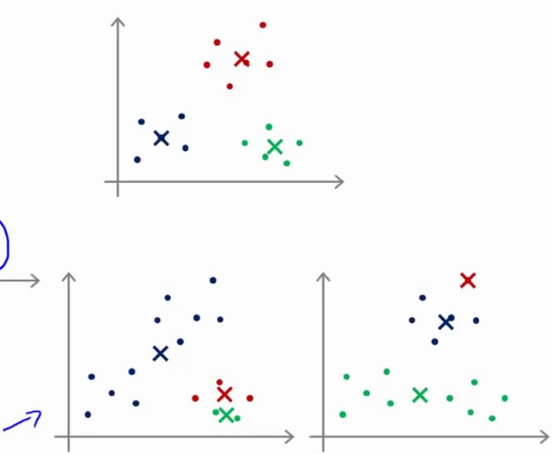
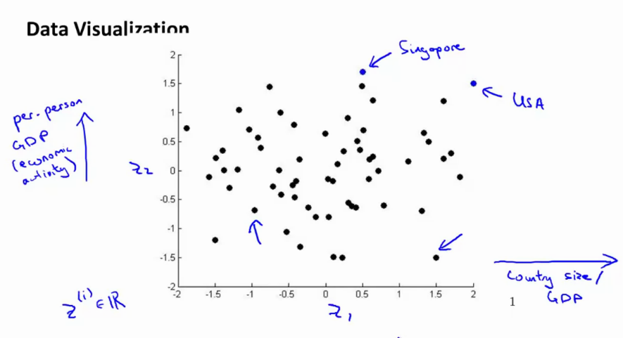
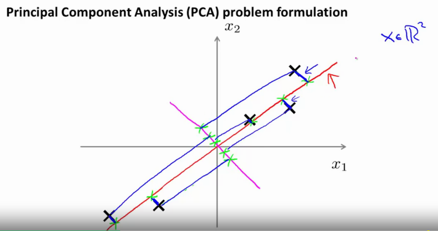
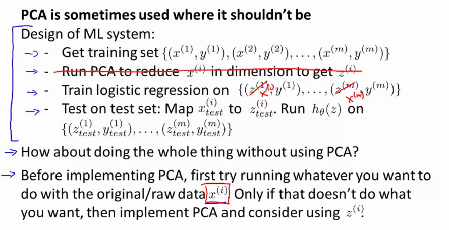

# Week 8 Notes

More generic notes @ [coursera website](https://www.coursera.org/learn/machine-learning/resources/kGWsY)

## Unsupervised learning

* Find some structure in some dataset
* Clustering algorithms
    * market segmentation
    * social network analysis
    * organize computing clusters
    * astronomical data analysis

## K-means algorithm

* by far the most widely used algorithm
* uses cluster centroids

Functions in two steps:

```
assign cluster centroids;

While !converged {

    1) Cluster assignment step (assign each datapoint to the closest cluster)
    2) Move centroid step (move the centroids to a new point, which is the mean of all the points in the cluster) --> converges if no movement is observed
}

```

Input: 

* $K$ (number of clusters)
* Training set $\trainingSetUnsupervised \in \RR^n$ (drop $x_0$ for convention)


Randomly initialize K centroids $\mu_1, \mu_2, ... , \mu_K \in \RR^n$

```matlab
while not(converged) {
    for i=1:m
        c_i := index(from 1 to K)  
        %of cluster centroid closest to x_i, calculated by taking the norm between x_i and mu_k --> min||x_i - mu_k||^2 and find k
    end
    for k=1:K
        mu_k := average(mean of points assigned to cluster k) % mean position of each of the points 1/m * sum(x(k)) in R^n
}
```

* If a cluster centroid has 0 points, delete it
* stop if convergence has been reached (ie if no cluster movement is performed)
* if the clusters are non-well-seperated K-means can still solve it.

### Optimization objective

* $\ssb{c}{i}$ = index of cluster (1,2,...K) to which an example $\ssb{x}{i}$ is currently assigned
* $\mu_k$ = cluster centroid $k$ ($\mu_k \in \RR^n$)
* $\mu_{\ssbi{c}}$ = cluster centroid of cluster to which example $\ssbi{x}$ has been assigned.

The optimization objective then becomes:

$$ J(\ssb{c}{1}, ... \ssb{c}{m}, \mu_1, ... \mu_K) = \frac{1}{m}\sum_{i=1}^{m}||\underbrace{\ssbi{x}}_{\textnormal{location of }\ssbi{x}} - \underbrace{\mu_{\ssbi{c}}}_{\textnormal{cluster centroid that belongs to }\ssbi{x}}||^2$$

Where the cluster assignment step minimizes the above, while keeping the cluster centroids fixed.

### Random initialization

Remember the K-means clustering algorithm. The first step is to randomly initialize the cluster centroids, but how?

* we should have the number of clusters < number of samples, i.e. $K < m$.
* randomly pick K training samples, set $\mu_1, \mu_2, ....., \mu_K$ equal to these K samples.
* this means that K-means can converge to different solutions! `K-means can end up in local optima of the distortion function J`



* `To solve this, we can initialize K-means more than once.` In other words, you execute it somewhere between 50 - 1000 times. Initialize, run k-means, get lowest distortion J.
* Pick clustering that gave the lowest cost/distortion $J$.
* `if you have a low number of clusters (ie K=2-10), its really important to run it multiple times.`

### Choosing the number of clusters

* it is an ambiguous question
* this is part of unsupervised learning.
* should have an automatic algorithm to choose, for example the elbow method

#### Elbow method

* vary K
    * run K-means with 1 cluster, get cost
    * run K-means with 2 clusters, get cost
    * ...
    * plot the result .you get a curve how the distrotion geos for increasing number of clusters
    * you get an elbow shape (see fig below), select the "elbow"


* Fairly often the curve will be much more ambiguous, and so it's not necessarily applicable (the location of the elbow is not very clear).
* `It's worth a shot, but don't get your hopes up`

## Dimensionality Reduction

### As data compression method

* to compress data from 2D to 1D in order to reduce redundancy, by removing highly correlated features
* $\ssb{x}{1} \in \RR^2 \ra \ssb{z}{1} \in \RR$
* $\ssb{x}{2} \in \RR^2 \ra \ssb{z}{2} \in \RR$
* also possible from 3D to 2D, ....

1) Take the $n$ dimensional data (3D)
2) project it onto a $n-1$ dimensional manifold (2D)
3) replot ..

### As data visualisation method



## PCA Problem Formulation

* Imagine $x \in \RR^2$
* Before you use PCA, make sure the data is zero mean and normalized.



* Project $x_1, x_2$ onto a new lower dimensional surface $z$, so that the projection error onto this surface is minimized.
* Reduce from 2D to 1D: find a direction (vector $\ssbi{u} \in \RR^n$) onto which to project the data so as to minimize the projection error.

More generally, we want to use `n-Dimensional to k-Dimensional` reductions. Find $k$ vectors $\ssb{u}{1}, \ssb{u}{2}, \ssb{u}{3} , ... \ssb{u}{k}$ onto which to project the data, so as to mimize the projection error.

* PCA != linear regression. In LR , we are minimizing the distance between the point and the value predicted by the hypothesis (left figure below0) (map from $x\ra y$). in PCA, we try to minimize the distance between the projection of the point to the line (rigth figure)


## PCA

### Preprocessing

* Given training set $\trainingSetUnsupervised$

Preprocessing is done by performing feature scaling / mean normalization:

$$ \mu_j = \frac{1}{m}\sum_{i=1}^m \ssbi{x}_j$$

$$ \Rightarrow x_j := x_j - \mu_j$$

### Finding the components

* proof is beyond scope of this course

* We want to reduce from $n$-dimensional to $k$-dimensional

Use the covariance matrix

$$ \underbrace{\Sigma}_{\textnormal{nxn}} = \frac{1}{m} \sum_{i=1}^n(\underbrace{\ssbi{x}}_{\textnormal{nx1}})(\underbrace{\ssbi{x}}_{\textnormal{1xn}})^T$$

Compute the eigenvectors of the matrix $\Sigma$, by using Singular Value Decomposition (SVD)

```matlab
[U, S, V] = svd(Sigma); % can also use eig(Sigma) 
% U = eigenvectors (nxn) 
```

`The covariance matrix is always symmetric positive definite.`

* U will be the eigenvectors, ie a nxn matrix. where the columns are the componentes. We use the first $k$ columns of this matrix as the dimensions.


Take the first $k$ columns to get a matrix $U_{reduce} =$nxk.
Then


```matlab
% get sigma
Sigma = (1/m) * X' * X;
% apply svd
[U, S, V] = svd(Sigma);
% reduce it by taking first k columns and calculate new basis z
z = U(:, 1:k)'*X; % x in R^n, not using x0=1!
```

## Reconstruction from Compressed representation

Remember that the compressed representation was created using $z=U_{reduce}^Tx;$

* Given a point $z \in \RR$, can we map it back to $x \in \RR^2$

$$ x_{approx} = U_{reduce} \cdot z$$

* what you get back are points that lie on the projection surface / line $z$. 


The variance of the data after PCA is equal to

$$ \frac{\sum_{i=1}^k S_{ii}}{\sum_{i=1}^n S_{ii}}$$

Which means that in the case of $k=n$ the variance remains the same, and $x_{approx} = x$ for each sample.

## Choosing the number of principle components

PCA tries to minimize the average squared projection error, ie 

$$ \frac{1}{m} \sum_{i=1}^m ||\ssbi{x} - x_{approx}^{(i)}||^2 $$

The total variation in the data is

$$  \frac{1}{m} \sum_{i=1}^m ||\ssbi{x} || ^2 $$

Typically, choose $k$ to be the smallest value so that

$$ \frac{\frac{1}{m} \sum_{i=1}^m ||\ssbi{x} - x_{approx}^{(i)}||^2}{\frac{1}{m} \sum_{i=1}^m ||\ssbi{x} || ^2} \leq 0.01$$

In other words, `that 99% of the variance is retained.` You can lower this to 95, but 99% is common. In order to retain most of the variance you can typically reduce the data by quite a lot.

## Algo

```matlab
k=1 

% 1) compute U_reduce, z1, ,.....

% 2) check if retained variacne < 0.01

k = 2

```

but this is very slow. Its better to use svd to do it more efficiently

Computing svd with

```matlab
[U, S, V] = svd(Sigma)

% S will be a diagonal matrix with everything off-diagonal being zero
% [ S11 0   0 
%   0   S22 0
%   0   0   S33]
% its possible to show that for a given value of k, the retained variacne can be computed as

retained_variance = 1-(sum(S11 + S22 + ... + Skk)/(sum(S11 +S22 + ... + Snn))) % shuold be <= 0.01

% you can now change the value of k above and figure out what has the smalelst value that has <= 0.01.

```

In other words, call svd once and pick the smallest value of $k$ for which the above variance constraint is maintained.

## Advice for applying PCA

### Supervised learning speedup

* imagine very high dimensional data, ie training set with samples that have 10 000D (ie image of 100px x 100px).

1) extract the inputs: $\ssb{x}{1}, \ssb{x}{2}, ... \ssb{x}{m} \in \RR^{10000}$
2) apply pca to get for example $\ssb{z}{1}, ...\ssb{z}{m} \in \RR^{1000}$ . This gives a new training set $\{(\ssb{z}{1}, \ssb{y}{1}), ... , (\ssb{z}{m}, \ssb{y}{m})\}$
3) Get hypothesis $\htx = h_{\t{}}(z) = \frac{1}{1+e^{-\T{}^Tz}}$

* Note: PCA defines a mapping $x \ra z$ shuold be defined by running PCA on the TRAINING set. The same mapping can be applied to the samples in validation / test set.

* We can usually PCA to reduce the dimensionality by 5x or even 10x.

### Application of PCA

* Compression
    * reducing disk usage
    * speed up learning algo
    * choose k by % of variance retain
* Visualisation
    * we can usually only plot 2D and 3D data
    * k = 2, k =3

`Theres one frequent mis-use of PCA: using it to prevent overfitting. You should not do this. You shuold use regularization instead of using pca. The reason you should not use it is because you are not using at the labels y.`

Always ask yourself "Will PCA help". Before you implement PCA, do it on the RAW data. if it does not do what you want, then consider pca. In other words, only if you dont have disk space or too little memory or whatever. You are still reducing data!




