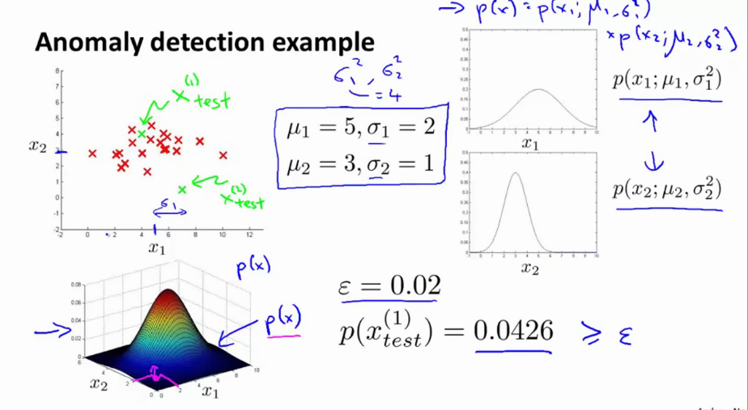
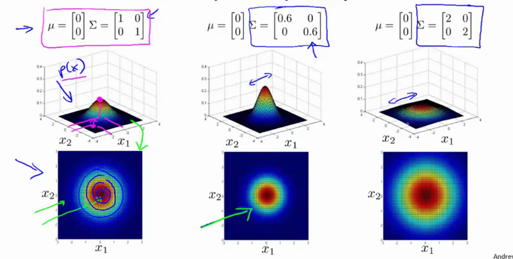
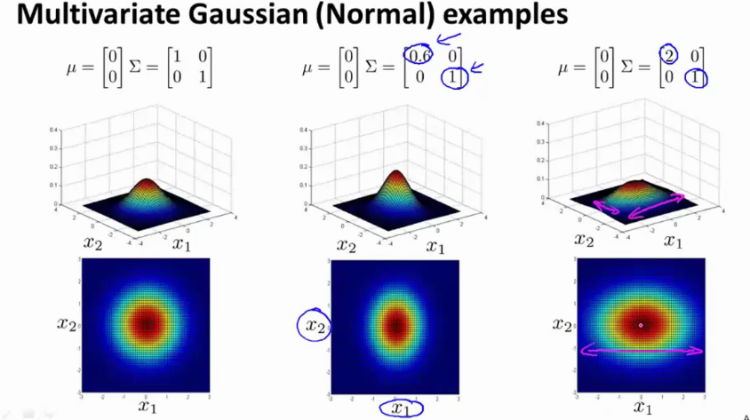
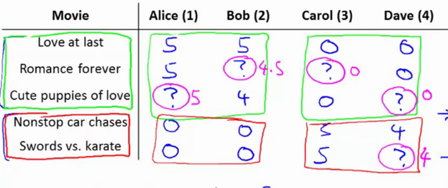

# Week 9 notes - Anomaly Detection

More general notes on the [coursera website](https://www.coursera.org/learn/machine-learning/resources/szFCa)

## Anomaly Detection

Example: aircraft engine features;

* $x_1$ : heat generated
* $x_2$ : vibration intensity
* ....
* dataset: $\trainingSetUnsupervised$
* New engine: $x_{test}$

Is the new engine $x_{test}$ anomalous?

1) Build a model $p(x)$.
2) If $p(x_{test}) \lt \epsilon \ra$ flag anomaly, if $\geq \epsilon$, flag ok.

Example of applications:

* Fraud detection: $x_i$ is features of user $i$ activities (typing speed, visit time, ...) $\ra$ model $p(x)$, identify unusual users.

* manufacturing

* monitoring computers in datacenter, $x_i$ is features of machine $i$ (machine load, netowrk traffic, memory use, ...). Model the usage, identify machine misuse or time-to-fail of the machine or...

## Gaussian Distribution

* = normal distribution
* if $x$ is gaussian distribution, it has mean $\mu$ and variance $\sigma^2$.

$$ x \sim \Nu (\mu, \sigma^2)$$

* center of bell shape is mu, width is sigma.

$$ p(x; \mu, \sigma^2) = \frac{1}{\sqrt{2*\pi} \sigma} exp\Bigg(-\frac{(x-\mu)^2}{2\sigma^2}\Bigg)$$

* area under curve must integrate to 1 :) property of probability distributions

### parameter estimation

* dataset $\trainingSetUnsupervised$ where $\ssbi{x} \in \RR$.


$$ \mu = \frac{1}{m} \sum_{i=1}^m \ssbi{x}$$

$$ \sigma^2 = \frac{1}{m} \sum_{i=1}^m (\underbrace{\ssbi{x} - \mu}_{\textnormal{value minus center}})^2$$

* these parameters are actually the maximum likelyhood estimates

* `sometimes yo will see 1/(m-1) but it makes no difference if training set is large enough.`

## Density Estimation - Algorithm

Given a training set $\trainingSetUnsupervised$, each example is $\ssbi{x} \in \RR$.

$$ p(x) = p(x_1;  \mu_1, \sigma_1^2)p(x_2; \mu_2, \sigma_2^2 )p(x_3; \mu_3, \sigma_3^2 )....p(x_n; \mu_n, \sigma_n^2 )$$

A bit more summarized:

$$ p(x) = \prod_{j=1}^n p(x_j; \mu_j, \sigma_j^2)$$

## Anomaly Detection Algorithm

1) Choose features $x_i$ you think might be indicative of anomalous examples
2) fit parameters $\mu_j \ra \mu_1, \mu_2, ....\mu_n$

$$ \mu_j = \frac{1}{m} \sum_{i=1}^m \ssbi{x}_j$$

$$ \sigma^2_j = \frac{1}{m} \sum_{i=1}^m (\ssbi{x}_j - \mu_j)^2$$

3) given new example $x$, compute $p(x)$:

$$ p(x) = \prod_{j=1}^n p(x_j; \mu_j, \sigma_j^2) =  \prod_{j=1}^n  \frac{1}{\sqrt{2\pi} \sigma_j} exp\Bigg(-\frac{(x_j-\mu_j)^2}{2\sigma_j^2}\Bigg)$$

An anomaly can be found if $p(x) \lt \epsilon$.

Vectorized:

$$\mu = \mat{\mu_1 \\ \mu_2 \\ \mu_3 \\ ... \\ \mu_n} = \frac{1}{m} \sum_{i=1}^{m}\ssbi{x}$$

$$\sigma^2 = \mat{\sigma^2_1 \\ \sigma^2_2 \\ \sigma^2_3 \\ ... \\ \sigma^2_n} = \frac{1}{m} \sum_{i=1}^{m}(\ssbi{x} - \mu)$$



* The new variance $\sigma$ is equal to the multiplication of the first variance with the second one, ie $\sigma_1^2 \cdot \sigma_2^2$. 

## Developing an anomaly detection system

* real number evaluation makes making decisions on what steps to take easier.
* Assume we have some labeled data, of anomalous and non-anomalous examples ($y=0$ if normal, $y=1$ if anomalous).

1) Training set: $\trainingSetUnsupervised$ (assume noraml examples / not anomalous)
2) Validation set: ^
3) Test set: ^

Example:

* 10 000 good engines
* 20 flawed engines
* Split it into train (6000 y=0) / validation 2000 (y=0)-10 (y=1) / test 2000 (y=0)-10 (y=1)
* `this means only anomalies in the validation / test set!`

Evaluation:

* fit model $p(x)$ on training set $\trainingSetUnsupervised$
* on a validation/test sample $x$, predict
    * y = 1 if $p(x) \lt \epsilon$ (anomaly)
    * y = 0 if $p(x) \geq \epsilon$ (normal)
* somewhat similar to supervised learning, where we evaluate by calculating the amount of correctly predicted samples.
* possible eval metrics: precision / recall / $f_1$-score
* can also use validation set to choose parameter $\epsilon$. You can try many different $\epsilon$ to find the one that has the highest $f_1$-score

## Anomaly detection vs supervised learning

If we have this labeled data, why not just use supervised learning to predict $y=0$ or $y=1$?

Anomaly detection should be used if

* you have a problem with `very small number of positive samples`
* `large number of negative examples (y=0), used to fit` $p(x)$.
* `many different types of anomalies`. hard for any algo to learn what the anomalies look like, and future anomalies might look completely different.
* examples:
    * fraud detection
    * manufacturing
    * monitoring machines

Supervised learning:

* `large number of positive and negative examples`
* enough positive examples for algo to get sense of what positives are like; future samples are likely to be similar to training set.
* examples:
    * email spam classification
    * weather prediction
    * cancer classification

## Choosing what features to use

* What features you use has huge effect
* We modelled features as gaussian distribution
    * plot a histogram of the data to make sure its gaussian
    * algo will often work just fine even if not gaussian
* if the data is really not gaussian, apply transformations to make it more gaussian. For example a 
    * $x = \log(x)$
    * even better $x=\log(x+c)$
    * $x=x^3$
    * $x=x^{1/2}$
    * ...

```matlab
x = data; 

hist(x, 50); % 50 bins
hist(x.^0.05, 50); % looks more gaussian

x_new = x.^0.05;
```

### Error analysis procedure

* want $p(x)$ is large for normal examples $x$.
* want $p(x)$ small for anomalous example $x$.

Most common problem:

* $p(x)$ is comparable (both large) for normal and anomalous examples
* find different feature $x_2$ that is more different from normal and anomalous.

### Example monitoring computers

* $x_1$ = memory use
* $x_2$ = disk access/sec
* $x_3$ = CPU load
* $x_4$ = network load
* lets say webservers, so cpu scales linearly with network. If now abnormally large cpu load might indicate a bug in a server ro whatever, so we can define a new feature
* $x_5 = \frac{\textnormal{cpu\_load}}{\textnormal{network\_load}}$
* $x_6 = \frac{\textnormal{cpu\_load}^2}{\textnormal{network\_load}}$

## Multivariate Gaussian Distribution

Given

* $p(x_1; \mu_1, \sigma_1^2)$
* $p(x_2; \mu_2, \sigma_2^2)$

Instead of modelling them seperately, model them all in one go

* $x \in \RR^n$
* parameters $\mu \in \RR^n, \Sigma \in \RR^{nxn}$ (covariance matrix)

Now

$$ p(x; \mu, \Sigma) = \frac{1}{(2\pi)^{n/2} |\Sigma|^{1/2}}exp\Bigg(-\frac{1}{2}(x-\mu)^T\Sigma^{-1}(x-\mu)\Bigg)$$

with $|\Sigma|$ being the determinant of sigma

### Examples



* if you shrink sigma, the height increases and the width decreases (integral has to equal 1)
* if you increase sigma, the width increases, the height becomes lower.

#### Changing one parameter at a time

* changes the scale in one direction



* if you change the values of the covariance matrix along the off-diagonal, you get more peaky distribution around the $x_1 = x_2$ line (positive correlation)


* you can also invert the values (ie make them negative), to get negative correlations

#### Changing values of $\mu$

* moves the peak of the distribution

### Anomaly detection using MV Gaussian

The probability of x is given by 

$$ p(x; \mu, \Sigma) = \frac{1}{(2\pi)^{n/2} |\Sigma|^{1/2}}exp\Bigg(-\frac{1}{2}(x-\mu)^T\Sigma^{-1}(x-\mu)\Bigg)$$

Given a training set $\trainingSetUnsupervised \in \RR^n$, $\mu$ and $\Sigma$ become

$$\mu = \frac{1}{m} \sum_{i=1}^{m}\ssbi{x}$$

$$\Sigma = \frac{1}{m} \sum_{i=1}^{m}(\ssbi{x} - \mu)(\ssbi{x} - \mu)^T$$

1) fit model p(x) by setting $\mu$ and $\Sigma$ as above
2) given a new example, compute the probability of x as above
3) flag anomalies if $p(x) < \epsilon$.

#### Relation between original model and mv model

$$ p(x) = p(x_1; \mu_1, \sigma_1^2) \times p(x_2; \mu_2, \sigma_2^2) \times p(x_3; \mu_3, \sigma_3^2) \times ... x p(x_n; \mu_n, \sigma_n^2)$$

Corresponds exactly to the multivariate gaussian

$$ p(x; \mu, \Sigma) = \frac{1}{(2\pi)^{n/2} |\Sigma|^{1/2}}exp\Bigg(-\frac{1}{2}(x-\mu)^T\Sigma^{-1}(x-\mu)\Bigg)$$

Where

$$\Sigma = \mat{\sigma_1^2 &    0   & .. & 0\\
                0           & \sigma_2^2 & .. & 0 \\
                0 & 0                   & .. & 0\\
                0& 0 & .. & \sigma_n^2}$$

### When to use original model / multivariate gaussian

Original model:

* manually create features where $x_1, x_2$ take unusual combination of values.
* computationally cheaper (scales better to large $n$=number of features)
* ok even if $m$ (training set size) is small
* corresponds to multivariate gaussian where the contours of $p(x; \mu, \Sigma)$ are axis-alligned

Multivariate model:

* automatically captures correlations between features
* computationally more expensive, we need to compute the inverse of $\Sigma$!
* must have $m \gt n$, else $\Sigma$ is non-invertible!! Typically only use multivariate model if $m \geq 10\cdot n$

If you find that $\Sigma$ is non-invertible, the reason is probably that

* $m \lt n$
* you have alot of redundant (linear dependent) features (ie $x_3 = x_4 + x_5$).

## Recommender systems

### Problem formulation

* i.e. what movies you will like, what you will buy next on amazon, ...

Running example: Predicting movie ratings

* user rates movies using 0-5 stars
* $n_u$ = number of users
* $n_m$ = number of movies
* $r(i, j) = 1$ if user $j$ has rated movie $i$
* $\ssb{y}{i,j}$ = rating given by user $j$ to movie $i$, defined only if $r(i, j) = 1$.



### Content based recommendations

See example above

* how do i predict the missing values?
* create features $x_1$ (romance level), $x_2$ (action level)


We can create features for each movie $i$, with $x_0 = 1$

$$\ssbi{x} = \mat{1 \\ 0.9 \\ 0}$$

For each user $j$, learn parameter $\ssb{\t{}}{j} \in \RR^3$. Predict user $j$ as rating movie $i$ with $(\ssb{\t{}}{j})^T\ssbi{x}$ stars.

Now we can predict for missing link cute puppies of love (movie 3) ($x_0 =1$), for user $j$ ($\ra \t{}^j$)

$$ \ssb{x}{3} = \mat{1 \\ 0.99 \\ 0}, \ssbi{\t{}} = \mat{0 \\ 5 \\ 0}$$

$$ (\ssb{\t{}}{j})^T\ssbi{x} = 5 \times 0.99 = 4.95$$

* $\ssb{\t{}}{j}$ = paramter vector for user $j$ 
* $\ssb{m}{j}$ = number of moveis rated by user $j$

To learn $\ssb{\t{}}{j}$: 

$$\undersetnorm{min}{\ssb{\t{}}{j}}\frac{1}{2\ssb{m}{j}} \sum_{i:r(i,j)=1} \Bigg((\ssb{\t{}}{j})^T\ssbi{x} - \ssb{y}{i,j}\Bigg)^2 + \frac{\lambda}{2\ssb{m}{j}} \sum_{k=1}^n(\ssb{\t{k}}{j})^2$$

$$ \Rightarrow \undersetnorm{min}{\ssb{\t{}}{j}}\frac{1}{2} \sum_{i:r(i,j)=1} \Bigg((\ssb{\t{}}{j})^T\ssbi{x} - \ssb{y}{i,j}\Bigg)^2 + \frac{\lambda}{2} \sum_{k=1}^n(\ssb{\t{k}}{j})^2$$

To learn all of the parameters for all of the users $\ssb{\t{}}{1}, \ssb{\t{}}{2}, ..., \ssb{\t{}}{n}$:

The optimization objective becomes 

$$ \undersetnorm{min}{\ssb{\t{}}{1}, \ssb{\t{}}{2}, ..., \ssb{\t{}}{n}}\frac{1}{2} \sum_{j=1}^{n_u}\sum_{i:r(i,j)=1} \Bigg((\ssb{\t{}}{j})^T\ssbi{x} - \ssb{y}{i,j}\Bigg)^2 + \frac{\lambda}{2} \sum_{j=1}^{n_u}\sum_{k=1}^n(\ssb{\t{k}}{j})^2$$

Gradient descent updates

* dont regularize theta0
* essentially the same as linear regression, but with different optimization objective.

`for this algo (content based recommendation) we assume that we have some features that describe the movies action, romacne, ...` 

## Collaborative filtering

* has the property of feature learing $\ra$ learns the features
* Given the example table from above, how do we know what $x_1, x_2, ... x_n$ is?

Imagine every user tells you what she likes in movies (ie romance). Now it becomes possible to infer what the features are.

What feature vector shuold $\ssb{x}{i}$ be so that $(\ssb{\t{}}{1})^T\ssb{x}{1} \approx y$

### Optimization algorithm

* users have given preferences, ie $\ssb{\t{}}{1}, \ssb{\t{}}{2}, ..., \ssb{\t{}}{n}$, learn $\ssbi{x}$: 

$$ \undersetnorm{min}{\ssbi{x}}\frac{1}{2} \overbrace{\sum_{\underbrace{j:r(i,j)=1}_{\textnormal{all j for we have a rating for movie i}}} \Bigg((\ssb{\t{}}{j})^T\ssbi{x} - \ssb{y}{i,j}\Bigg)^2}^{\textnormal{find features that are close to the actual value the user gave}} + \frac{\lambda}{2} \sum_{k=1}^n(\ssb{x}{i}_k)^2$$

For all users at the same time, sum over all movies $\ssb{x}{1}, \ssb{x}{2},...,\ssb{x}{n}$

$$ \undersetnorm{min}{\ssb{x}{1}, \ssb{x}{2},...,\ssb{x}{n}}\frac{1}{2} \sum_{j=1}^{n_m}\sum_{i:r(i,j)=1} \Bigg((\ssb{\t{}}{j})^T\ssbi{x} - \ssb{y}{i,j}\Bigg)^2 + \frac{\lambda}{2} \sum_{j=1}^{n_u}\sum_{k=1}^n(\ssb{x}{j}_k)^2$$

Randomly guess some initial values of $\t{}$. Given some set of movie ratings $x$, update the estimate of $\t{}$

$$ \t{} \ra x \ra \t{} \ra x \ra ..$$

* when you run this algorithm with a large set of users, everyone helps in making all of the predictions better "for the common good", ie. collaborative filtering

### Collaborative filtering algoritm

Two things have already been suggested: 

* Given $\ssb{x}{1}, \ssb{x}{2},...,\ssb{x}{n_m}$, estimate $\ssb{\t{}}{1}, \ssb{\t{}}{2}, ..., \ssb{\t{}}{n_u}$:

$$ \undersetnorm{min}{\ssb{\t{}}{1}, \ssb{\t{}}{2}, ..., \ssb{\t{}}{n_u}}\frac{1}{2} \sum_{j=1}^{n_u}\sum_{i:r(i,j)=1} \Bigg((\ssb{\t{}}{j})^T\ssbi{x} - \ssb{y}{i,j}\Bigg)^2 + \frac{\lambda}{2} \sum_{j=1}^{n_u}\sum_{k=1}^n(\ssb{\t{k}}{j})^2$$

* Given $\ssb{\t{}}{1}, \ssb{\t{}}{2}, ..., \ssb{\t{}}{n_u}$, estimate $\ssb{x}{1}, \ssb{x}{2},...,\ssb{x}{n_m}$: 

$$ \undersetnorm{min}{\ssb{x}{1}, \ssb{x}{2},...,\ssb{x}{n_m}}\frac{1}{2} \sum_{i=1}^{n_m}\sum_{i:r(i,j)=1} \Bigg((\ssb{\t{}}{j})^T\ssbi{x} - \ssb{y}{i,j}\Bigg)^2 + \frac{\lambda}{2} \sum_{i=1}^{n_m}\sum_{k=1}^n(\ssb{x}{j}_k)^2$$

* we cuold do it back adn forth as above

But, lets put both optimization objectives together:

$$ J(\ssb{x}{1},...,\ssb{x}{n_m}, \ssb{\t{}}{1}, ..., \ssb{\t{}}{n_u}) =\frac{1}{2} \sum_{\underbrace{(i,j):r(i,j)=1}_{\textnormal{sum over all users-movies pairs}}} \Bigg((\ssb{\t{}}{j})^T\ssbi{x} - \ssb{y}{i,j}\Bigg)^2 + \frac{\lambda}{2} \sum_{i=1}^{n_m}\sum_{k=1}^n(\ssb{x}{j}_k)^2 + \frac{\lambda}{2} \sum_{j=1}^{n_u}\sum_{k=1}^n(\ssb{\t{k}}{j})^2 $$

So instead of going back and forth, we just optimize everything simultaneously.

`Note that we DONT use the x_0 = 1 term, NO INTERCEPT! We learn all of the parameters so we dont need to hardcore x0`

1) Initialize $\ssb{x}{1}, \ssb{x}{2},...,\ssb{x}{n_m}$ to small random values
2) Minimize $\ssb{\t{}}{1}, \ssb{\t{}}{2}, ..., \ssb{\t{}}{n_u}$ using gradient descent


## Vectorization: low rank matrix factorization

Lets work out an alternative way to do collaborative filtering. Using the leading example above, with $n_m = 5, n_u=4$. 


$$ Y = \mat{5 & 5 & 0 & 0\\
            5 & ? & ? & 0\\
            ? & 4 & 0 & ?\\
            0 & 0 & 5 & 4\\
            0 & 0 & 5 & 0}$$

What user $j$ predicts on movie $i$ is: 

$$ \textnormal{predictions} = \mat{(\ssb{\t{}}{1})^T\ssb{x}{1} & \overbrace{(\ssb{\t{}}{2})^T\ssb{x}{1}}^{\textnormal{predicted rating of user 2 on movie 1}} & ... & (\ssb{\t{}}{n_u})^T\ssb{x}{1} \\ (\ssb{\t{}}{1})^T\ssb{x}{2} & (\ssb{\t{}}{2})^T\ssb{x}{2} & ... & (\ssb{\t{}}{n_u})^T\ssb{x}{2} \\ ... & ... & ...& ... \\ \underbrace{(\ssb{\t{}}{1})^T\ssb{x}{n_m}}_{\textnormal{predicted rating of user 1 on last movie}} & (\ssb{\t{}}{2})^T\ssb{x}{n_m} & ... & (\ssb{\t{}}{n_u})^T\ssb{x}{n_m}}$$

Define a matrix $X$ and $\T{}$

$$ X = \mat{-(\ssb{x}{1})^T- \\ -(\ssb{x}{2})^T- \\ ... \\ -(\ssb{x}{n_m})^T-}, \T{} = \mat{-(\ssb{\t{}}{1})^T- \\ -(\ssb{\t{}}{2})^T- \\ ... \\ -(\ssb{\t{}}{n_u})^T-}$$

Now we can easily apply

$$ \textnormal{Predictions} = X\cdot\T{}^T$$

This is called low-rank matrix factorization

#### Finding related movies

* for each product $i$, we learn feature vectro $\ssbi{x} \in \RR^N$.
    * $x_1, x_2, ... x_n$ for all features such as romance, comedy ,...
* typically very difficult to humanly understand

How can we find movies $j$ related to movie $i$? If the user is currently watching $i$, how can we find a good $j$?

By taking the movies that have big similarity:

$$ \textnormal{small} ||\ssbi{x} - \ssb{x}{j}||$$

### Mean normalization

* can make the algo work better

Users who have not rated any movies:

* learn parameters for the new user
* first term in the minimization problem is non existant (no ratigns for user)
* only the regularization term is used!

However, this way each new users always rate all movies 0 stars. this breaks the idea, because all movies are "shit" LOL.

Instead, lets add the new user to the y-matrix, and introduce a $\mu$ matrix that has the average (mean) of the ratings for a particular movie (row-mean)

$$ Y = \mat{5 & 5 & 0 & 0 & ?\\
            5 & ? & ? & 0 & ?\\
            ? & 4 & 0 & ? & ?\\
            0 & 0 & 5 & 4 & ?\\
            0 & 0 & 5 & 0 & ?}, \mu = \mat{2.5 \\ 2.5 \\ 2 \\ 2.25 \\ 1.25}$$

Subtract off all the means, so the values are 0-mean

$$ Y = Y-\mu = \mat{2.5 & 2.5 & -2.5 & -2.5 & ?\\
            2.5 & ? & ? & -2.5 & ?\\
            ? & 2 & -2 & ? & ?\\
            -2.25 & -2.25 & 2.75 & 1.75 & ?\\
            -1.25 & -1.25 & 3.75 & -1.25 & ?}$$

Then, for user $j$ on movie $i$, predict (and add the mu term): 

$$ (\ssb{\t{}}{j})^T(\ssbi{x}) + \mu_i$$

Then, the new user will predict the mean of the other users on the movie.

$$\underbrace{(\ssb{\t{}}{5})^T(\ssbi{x})}_{\textnormal{evaluates to 0}} + \mu_i$$

So the Y matrix now becomes

$$ Y = Y-\mu = \mat{2.5 & 2.5 & -2.5 & -2.5 & \mu_1\\
            2.5 & ? & ? & -2.5 & \mu_2\\
            ? & 2 & -2 & ? & \mu_3\\
            -2.25 & -2.25 & 2.75 & 1.75 &\mu_4\\
            -1.25 & -1.25 & 3.75 & -1.25 & \mu_5} =
            \mat{2.5 & 2.5 & -2.5 & -2.5 & 2.5\\
            2.5 & ? & ? & -2.5 & 2.5\\
            ? & 2 & -2 & ? & 2\\
            -2.25 & -2.25 & 2.75 & 1.75 & 2.25\\
            -1.25 & -1.25 & 3.75 & -1.25 & 1.25}
            $$

