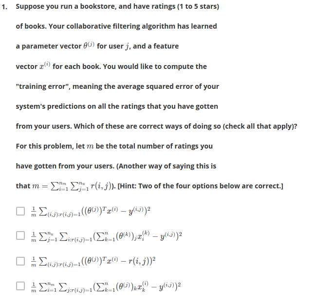

# Quiz Recommender Network

## Q1



`first two are right, look at notes. the second oen is just the first one where the frist sum term is split off`

The above was actually wrong


## q2

In which of the following situations will a collaborative filtering system be the most appropriate learning algorithm (compared to linear or logistic regression)?

* [ ] You manage an online bookstore and you have the book ratings from many users. You want to learn to predict the expected sales volume (number of books sold) as a function of the average rating of a book. `regression`

* [x] You manage an online bookstore and you have the book ratings from many users. For each user, you want to recommend other books she will enjoy, based on her own ratings and the ratings of other users. 

* [`!`x] You've written a piece of software that has downloaded news articles from many news websites. In your system, you also keep track of which articles you personally like vs. dislike, and the system also stores away features of these articles (e.g., word counts, name of author). Using this information, you want to build a system to try to find additional new articles that you personally will like. `probably logistic regression`

* [x] You run an online news aggregator, and for every user, you know some subset of articles that the user likes and some different subset that the user dislikes. You'd want to use this to find other articles that the user likes.

`this was wrong`

* [ ] You're an artist and hand-paint portraits for your clients. Each client gets a different portrait (of themselves) and gives you 1-5 star rating feedback, and each client purchases at most 1 portrait. You'd like to predict what rating your next customer will give you. `imo regression.`

* [x] You own a clothing store that sells many styles and brands of jeans. You have collected reviews of the different styles and brands from frequent shoppers, and you want to use these reviews to offer those shoppers discounts on the jeans you think they are most likely to purchase. `recommender`

* [x] You run an online bookstore and collect the ratings of many users. You want to use this to identify what books are "similar" to each other (i.e., if one user likes a certain book, what are other books that she might also like?)

## q3

You run a movie empire, and want to build a movie recommendation system based on collaborative filtering. There were three popular review websites (which we'll call A, B and C) which users to go to rate movies, and you have just acquired all three companies that run these websites. You'd like to merge the three companies' datasets together to build a single/unified system. On website A, users rank a movie as having 1 through 5 stars. On website B, users rank on a scale of 1 - 10, and decimal values (e.g., 7.5) are allowed. On website C, the ratings are from 1 to 100. You also have enough information to identify users/movies on one website with users/movies on a different website. Which of the following statements is true?

* [ ] You can combine all three training sets into one as long as your perform mean normalization and feature scaling after you merge the data. `do it before the merge..`

* [ ] It is not possible to combine these websites' data. You must build three separate recommendation systems.

* [ ] You can combine all three training sets into one without any modification and expect high performance from a recommendation system.

* [x] You can merge the three datasets into one, but you should first normalize each dataset separately by subtracting the mean and then dividing by (max - min) where the max and min (5-1) or (10-1) or (100-1) for the three websites respectively.

## q4

Which of the following are true of collaborative filtering systems? Check all that apply.

* [ ] For collaborative filtering, the optimization algorithm you should use is gradient descent. In particular, you cannot use more advanced optimization algorithms (L-BFGS/conjugate gradient/etc.) for collaborative filtering, since you have to solve for both the $\ssbi{x}, \ssb{\t{}}{j}$'s simultaneously. `others can also do this?`

* [ ] Suppose you are writing a recommender system to predict a user's book preferences. In order to build such a system, you need that user to rate all the other books in your training set. `no you can use other's ratings as well, or a subset`

* [x] Even if each user has rated only a small fraction of all of your products (so $r(i,j)=0$ for the vast majority of $(i,j)$ pairs), you can still build a recommender system by using collaborative filtering. `yes, every user contributes a bit (collaborative...)`

* [x] For collaborative filtering, it is possible to use one of the advanced optimization algoirthms (L-BFGS/conjugate gradient/etc.) to solve for both the $\ssbi{x}, \ssb{\t{}}{j}$'s simultaneously.

* [ ] To use collaborative filtering, you need to manually design a feature vector for every item (e.g., movie) in your dataset, that describes that item's most important properties. `nope`

* [ ] When using gradient descent to train a collaborative filtering system, it is okay to initialize all the parameters ($\ssbi{x}, \ssbi{\t{}}$) to zero. `no`

* [ ] Recall that the cost function for the content-based recommendation system is J = .... Suppose there is only one user and he has rated every movie in the training set. This implies that $n_u = 1$ and $r(i,j)=1$ for every $i,j$. In this case, the cost function $J(\t{})$ is equivalent to the one used for regularized linear regression.

* [x] If you have a dataset of users ratings' on some products, you can use these to predict one user's preferences on products he has not rated.


## q5

Suppose you have two matrices $A$ and $B$, where $A$ is 5x3 and $B$ is 3x5. Their product is $C=AB$, a 5x5 matrix. Furthermore, you have a 5x5 matrix $R$ where every entry is 0 or 1. You want to find the sum of all elements $C(i,j)$ for which the corresponding $R(i,j)$ is 1, and ignore all elements  $C(i,j)$ where $R(i,j)=0$. One way to do so is the following code:

```matlab
C = A * B;
total=0;
for i =1:5
    for j = 1:5
        if (R(i,j) == 1)
            total = total + C(i,j);
        endif
    endfor
endfor
```

Which of the following pieces of Octave code will also correctly compute this total? Check all that apply. Assume all options are in code.

```matlab
* [x] total = sum(sum((A * B) .* R)) % is sum(C*R);

* [x] C = (A * B) .* R; total = sum(C(:)); % is sum(C*R)

* [x] C = A * B; total = sum(sum(C(R == 1)));

* [ ] total = sum(sum((A * B) * R)); % is sum(C*R');

* [ ] C = (A * B) * R; total = sum(C(:));
```


To figure this: 

```matlab

>> A
A =

   5   5   5
   5   5   5
   5   5   5
   5   5   5
   5   5   5

>> B
B =

   2   2   2   2   2
   2   2   2   2   2
   2   2   2   2   2

>> C
C =

   30   30   30   30   30
   30   30   30   30   30
   30   30   30   30   30
   30   30   30   30   30
   30   30   30   30   30

>> R = rand(5,5) > 0.5
R =

  0  1  0  1  1
  0  0  1  0  0
  0  1  0  0  0
  0  1  0  1  1
  1  0  0  1  1

>> total=0;
>> for i =1:5
    for j = 1:5
        if (R(i,j) == 1)
            total = total + C(i,j);
        endif
    endfor
endfor
>> total
total =  330


```